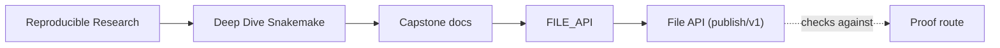
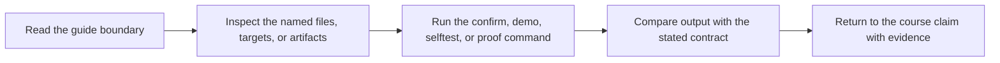

# File API (publish/v1)

<!-- page-maps:start -->
## Guide Maps

<!-- page-maps:end -->

This capstone exports a small, versioned set of artifacts under `publish/v1/`.
All JSON files:

* are UTF-8
* end with a newline
* are deterministic (sorted keys where applicable)
* include `schema_version` for forward-compatible evolution

The per-sample intermediate files live under `results/{sample}/` and are
documented here as well because they form the workflow contracts.

## Results per sample (`results/{sample}/`)

### `qc_raw.json` / `qc_trimmed.json`

Produced by: `python -m capstone.qc_fastq`

Minimal fields:

* `schema_version` (int)
* `path` (str)
* `reads` (int)
* `bases` (int)
* `mean_read_length` (float)
* `gc_fraction` (float)
* `n_fraction` (float)
* `qual_mean_per_pos` (list[float])
* `length_hist` (dict[int,int])

### `trim.json`

Produced by: `python -m capstone.trim_fastq`

* `schema_version`
* `input_fastq`
* `output_fastq`
* `reads_in`, `reads_out`
* `bases_in`, `bases_out`
* `filters` (counts for each filter reason)

### `dedup.json`

Produced by: `python -m capstone.dedup_fastq`

* `schema_version`
* `mode` (`dedup` or `copy`)
* `reads_in`, `reads_out`
* `unique_keys` (int)

### `kmer.json`

Produced by: `python -m capstone.kmer_profile`

* `schema_version`
* `k`
* `signature_size`
* `unique_kmers`
* `total_kmers`
* `signature` (list[int])
* `top_kmers` (list[{kmer,count}])

### `screen.json`

Produced by: `python -m capstone.screen_panel`

* `schema_version`
* `k`
* `signature_size`
* `scores` (sorted list of panel hits)

## Published API (`publish/v1/`)

### `discovered_samples.json`

Produced by the checkpoint `discover_samples`.

* `schema_version`
* `raw_dir`, `glob`, `n_files`
* `samples` mapping: `{sample: {mode: SE|PE, reads: {SE|R1|R2: path}}}`

### `summary.json` and `summary.tsv`

Produced by: `python -m capstone.summarize`

* `schema_version`
* `samples`: `{sample: {...}}` (merged metrics from all upstream steps)

### `report/index.html`

Produced by: `python -m capstone.report`

Static HTML report (no external JS/CSS).

### `provenance.json`

Produced by rule `provenance`.

Records:

* timestamps
* Python/Snakemake versions
* git commit (if available)
* the fully materialized config

### `manifest.json`

Produced by: `python -m capstone.manifest`

* `schema_version`
* `files`: mapping `relative_path -> {sha256, bytes}`
