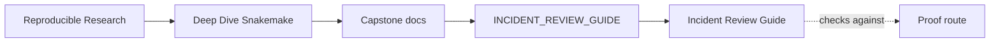
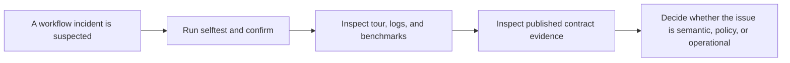

# Incident Review Guide

<!-- page-maps:start -->
## Guide Maps

<!-- page-maps:end -->

This guide explains how to review workflow incidents without collapsing everything into
one vague question about whether the pipeline "works."

Use `EXECUTION_EVIDENCE_GUIDE.md` first when the confusion is about which executed
surface answers which kind of question.

---

## Primary Review Route

1. Run `make selftest` when the question is determinism across core counts.
2. Run `make confirm` when the question is clean-room contract verification.
3. Run `make tour` when the question is about executed evidence, logs, and summary artifacts.
4. Compare the result with `publish/v1/`, `FILE_API.md`, and the relevant profile bundle if needed.

[Back to top](#top)

---

## What The Review Should Distinguish

- semantic workflow failures versus executor or policy differences
- publish-boundary problems versus internal repository noise
- nondeterminism versus a normal but unexpected rebuild

[Back to top](#top)

---

## Review Questions

- Which command gives the narrowest honest answer to the current failure question?
- Which evidence would you inspect before changing the workflow itself?
- Which boundary would you distrust first if serial and parallel publish results diverged?

Use `REVIEW_ROUTE_GUIDE.md` when you need to decide whether this is really an incident
review question or a publish, profile, or stewardship question instead.

[Back to top](#top)
