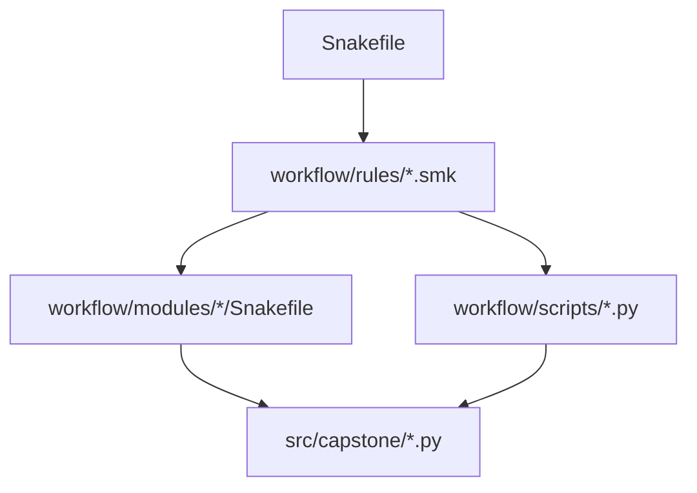

# Module Boundary Guide

<!-- page-maps:start -->
## Guide Maps

<!-- page-maps:end -->

This guide explains one of the capstone’s more subtle layout lessons: not all reuse is
the same kind of reuse. Some logic belongs in visible Snakemake rule families, some in
reusable workflow modules, some in workflow-adjacent scripts, and some in the Python
package.

---

## Boundary Claim

The capstone should keep four different kinds of work separate:

- `workflow/rules/*.smk` owns rule contracts and visible DAG meaning
- `workflow/modules/*/Snakefile` owns reusable rule templates
- `workflow/scripts/*.py` owns workflow-adjacent one-off scripting
- `src/capstone/*.py` owns reusable processing logic that deserves direct tests

When those surfaces blur, the repository gets harder to teach and harder to change.

---

## Which Surface Owns What

| Surface | Owns | Example in this capstone |
| --- | --- | --- |
| `workflow/rules/*.smk` | concrete rule wiring, logs, benchmarks, resources, and named inputs/outputs | `preprocess.smk` deciding how `trim_fastq`, `dedup_fastq`, and `kmer_profile` connect |
| `workflow/modules/*/Snakefile` | reusable workflow rule templates with placeholders | `qc_module/Snakefile` and `screen_module/Snakefile` |
| `workflow/scripts/*.py` | workflow-side scripts that materialize run metadata or helper outputs | `workflow/scripts/provenance.py` |
| `src/capstone/*.py` | reusable implementation code that can run outside Snakemake as a Python module | `trim_fastq.py`, `kmer_profile.py`, `screen_panel.py` |

---

## Reading Route

1. `workflow/rules/preprocess.smk`
2. `workflow/modules/qc_module/Snakefile`
3. `workflow/modules/screen_module/Snakefile`
4. `workflow/scripts/provenance.py`
5. `src/capstone/`

That route moves from visible DAG meaning to reusable rule templates, then to
workflow-specific scripting, and finally to reusable package code.

---

## Review Questions

- If a rule contract changes, which surface should show that change most visibly?
- If the same rule pattern appears twice, is that a module problem or a package problem?
- Which code would still make sense if Snakemake disappeared tomorrow?
- Which file would you inspect first if provenance behavior changed without altering sample processing?

