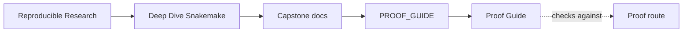
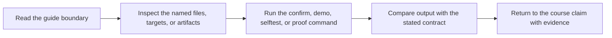

# Proof Guide

<!-- page-maps:start -->
## Guide Maps

<!-- page-maps:end -->

Use this guide when you want the shortest route from a Snakemake claim to the target,
file, or artifact that defends it.

## Claims And Their First Evidence

| Claim | First target | First files to inspect |
| --- | --- | --- |
| rule contracts are explicit and durable | `make walkthrough` | `Snakefile`, `workflow/rules/common.smk`, `FILE_API.md` |
| dynamic discovery is explicit instead of hidden | `make walkthrough` | `Snakefile`, `publish/v1/discovered_samples.json` |
| the published boundary is stable and reviewable | `make verify` | `FILE_API.md`, `publish/v1/manifest.json`, `publish/v1/provenance.json` |
| workflow execution remains deterministic across core counts | `make selftest` | `tests/selftest.sh`, `publish/v1/summary.json` |
| clean-room confirmation protects the full repository contract | `make confirm` | `Makefile`, `tests/`, `publish/v1/` |

## Best Reading Order

1. `README.md`
2. `PROOF_GUIDE.md`
3. `Snakefile`
4. `workflow/rules/common.smk`
5. `workflow/rules/publish.smk`
6. `FILE_API.md`

That route keeps contract and public surface ahead of implementation detail.
