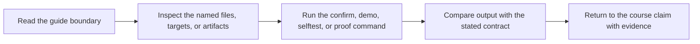

# Proof Guide

<!-- page-maps:start -->
## Guide Maps

<!-- page-maps:end -->

Use this guide when you want the shortest route from a Snakemake claim to the target,
file, or artifact that defends it.

## Claims And Their First Evidence

| Claim | First target | First files to inspect |
| --- | --- | --- |
| fresh-machine setup is explicit and repeatable | `make bootstrap-confirm` | `Makefile`, `environment.yaml`, `artifacts/venv/` |
| rule contracts are explicit and durable | `make walkthrough` | `Snakefile`, `workflow/rules/common.smk`, `FILE_API.md` |
| dynamic discovery is explicit instead of hidden | `make walkthrough` | `Snakefile`, `publish/v1/discovered_samples.json` |
| the published boundary is stable and reviewable | `make verify` | `FILE_API.md`, `publish/v1/manifest.json`, `publish/v1/provenance.json` |
| the published boundary can be summarized without losing its public meaning | `make publish-summary` | `scripts/publish_summary.py`, `publish-summary.json`, `publish/v1/` |
| the resolved configuration can be inspected without reading five files separately | `make config-summary` | `scripts/config_summary.py`, `config-summary.json`, `publish/v1/provenance.json` |
| internal per-sample surfaces can be reviewed before opening every result file | `make results-summary` | `scripts/results_summary.py`, `results-summary.json`, `results/` |
| executed logs, benchmarks, and provenance can be reviewed as one evidence surface | `make evidence-summary` | `scripts/evidence_summary.py`, `evidence-summary.json`, `logs/`, `benchmarks/` |
| workflow execution remains deterministic across core counts | `make selftest` | `tests/selftest.sh`, `publish/v1/summary.json` |
| clean-room confirmation protects the full repository contract | `make confirm` | `Makefile`, `tests/`, `publish/v1/` |
| the capstone exposes one learner-facing bundled proof route | `make proof` | `tour`, `verify-report`, and `profile-audit` artifacts |
| profile differences stay operational instead of semantic | `make profile-summary` | `scripts/profile_summary.py`, `profile-summary.json`, `profiles/` |

## Route By Review Goal

- Domain vocabulary and sample-to-report story: `DOMAIN_GUIDE.md`
- Stage ownership and first proof surface: `WORKFLOW_STAGE_GUIDE.md`
- Configuration truth and materialization: `CONFIG_CONTRACT_GUIDE.md`
- Internal results versus public publish surfaces: `RESULTS_BOUNDARY_GUIDE.md`
- Executed logs, benchmarks, summaries, and provenance: `EXECUTION_EVIDENCE_GUIDE.md`
- Checkpoint and dynamic DAG review: `CHECKPOINT_GUIDE.md`
- Exact file routing for a concrete question: `EXACT_SOURCE_GUIDE.md`
- Choosing the right guide, command, or bundle: `REVIEW_ROUTE_GUIDE.md`
- Repository ownership: `ARCHITECTURE.md`
- First contact and visible rule surface: `WALKTHROUGH_GUIDE.md`
- Publish-boundary trust: `PUBLISH_REVIEW_GUIDE.md`
- Profile and executor policy: `PROFILE_AUDIT_GUIDE.md`
- Incident and determinism review: `INCIDENT_REVIEW_GUIDE.md`
- Future changes: `EXTENSION_GUIDE.md`

## Best Reading Order

1. `README.md`
2. `PROOF_GUIDE.md`
3. `Snakefile`
4. `workflow/rules/common.smk`
5. `workflow/rules/publish.smk`
6. `FILE_API.md`

That route keeps contract and public surface ahead of implementation detail.
