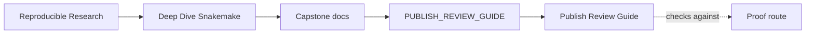
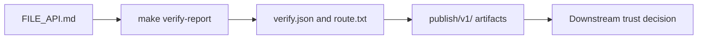

# Publish Review Guide

<!-- page-maps:start -->
## Guide Maps

<!-- page-maps:end -->

This guide explains how to review the publish boundary as a contract, not only as a
directory that happens to contain files.

Use `RESULTS_BOUNDARY_GUIDE.md` first when the real question is whether a surface
deserves promotion into the publish contract at all.

---

## Primary Review Route

1. Read `FILE_API.md`.
2. Run `make publish-summary` when you need the shortest honest publish overview.
3. Run `make verify-report` when you need the fuller contract review bundle.
4. Read `PUBLISH_REVIEW_GUIDE.md`, `publish-summary.json`, `verify.json`, `route.txt`, and `review-questions.txt` in the bundle.
5. Compare the report with `manifest.json`, `discovered_samples.json`, `summary.json`, `summary.tsv`, and `provenance.json`.
6. Read `report/index.html` when you need the compact human-facing publish surface.

[Back to top](#top)

---

## What The Review Should Settle

- which files are safe for downstream trust
- which checks are proving existence, parseability, and contract shape
- which files remain internal execution state even if they are useful during review
- which published summary surfaces are optimized for machine comparison versus human review

[Back to top](#top)

---

## Failure Questions

- Which publish artifact would be hardest to change safely without a version bump?
- Which publish check would you strengthen first if downstream trust became more demanding?
- Which internal result would you refuse to promote without a clearer contract?

[Back to top](#top)
