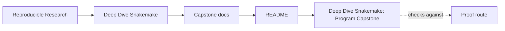
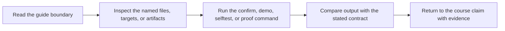
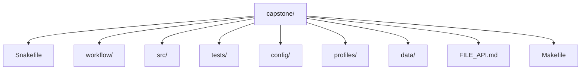

<a id="top"></a>

# Deep Dive Snakemake: Program Capstone


<!-- page-maps:start -->
## Guide Maps




<!-- page-maps:end -->

A compact, end-to-end Snakemake workflow that demonstrates rigorous engineering practices on toy FASTQ inputs. The biological analysis is intentionally minimal; the emphasis is on workflow correctness, reproducibility, and maintainability: explicit contracts, safe dynamic DAGs, governed configuration, versioned publishing, artifact verification, and execution across contexts (local, CI, cluster, Docker).

This project is designed to be **executed**, **studied**, and **extended** as a reference implementation.

> The CI workflow executes full confirmation runs, including workflow execution and artifact validation.
>
> On a fresh machine, `make bootstrap-confirm` is the shortest supported setup-and-proof route.
>
> Supported semantics are pinned to **Snakemake 9.14.x**. If you bypass `make bootstrap-confirm`, verify your global `snakemake --version` first.

[Back to top](#top)

---

## Purpose

This capstone provides a practical reference for constructing Snakemake workflows that remain reliable at scale. It addresses common failure modes—implicit dependencies, unsafe dynamic behavior, partial outputs, configuration drift, and reproducibility gaps—through disciplined patterns:

- Early and explicit failure detection
- Clear input/output contracts and deterministic paths
- Safe handling of dynamic DAGs via checkpoints
- Strict configuration validation and modular composition
- Versioned, integrity-checked publishing
- Comprehensive testing and verification gates

The workflow is deliberately small yet complete, allowing full execution and inspection on any machine.

[Back to top](#top)

---

## Study goal

Use this capstone to answer one question repeatedly:

> If this workflow changed tomorrow, which file or boundary should absorb that change, and why?

If the program is doing its job, the answer should get clearer after each module.

[Back to top](#top)

---

## Where it fits in the program

The capstone is designed as corroboration, not as the learner's first exposure to every
concept. It is most useful once a module has already made the idea legible in a smaller
setting.

| Program area | What the capstone lets you verify | Best first command |
| --- | --- | --- |
| Modules 01-02 | truthful file contracts, dynamic discovery, and durable discovery artifacts | `make walkthrough` |
| Modules 03-04 | profiles, CI-style gates, module boundaries, and executor-proof behavior | `make tour` |
| Modules 05-06 | software boundaries, provenance, publish surfaces, and downstream contracts | `make proof` |
| Modules 07-09 | repository architecture, operating-context drift, logs, benchmarks, and incident evidence | `make proof`, then `make profile-audit` |
| Module 10 | workflow review, migration, governance, and tool-boundary judgment | `make confirm` |

If you are new to Snakemake, use this repository after you understand the module’s local
exercise or mental model. The capstone should confirm understanding, not replace first
contact teaching.

The practical rule is simple: finish the module exercise first, then choose the smallest
capstone route that answers the next honest question. `walkthrough` is for first
contact, `tour` is for executed repository review, `proof` is for the larger
corroboration bundle, and `confirm` is for the strongest stewardship pass.

If you are still unsure, use this escalation order:

1. `make walkthrough`
2. `make tour`
3. `make selftest`
4. `make verify-report`
5. `make proof`
6. `make confirm`

If you need a clean learner or review download instead of a working tree, run:

```bash
make source-baseline-clean
make source-baseline-check
make source-bundle
```

Then read [`SOURCE_BASELINE_GUIDE.md`](docs/SOURCE_BASELINE_GUIDE.md) before distributing the archive.

[Back to top](#top)

---

## Key Concepts Demonstrated

### Workflow Design
- Explicit rule contracts with stable filenames and directories
- Protected and temporary outputs to prevent partial artifacts
- Safe dynamic DAGs using checkpoints and proper re-evaluation
- Scatter/gather patterns for per-sample and run-level processing
- Modular rule organization with namespacing
- Clear separation of internal intermediates (`results/`) and published deliverables (`publish/vN/`)

### Operational Practices
- Execution profiles for environment-specific settings
- Structured, per-rule logging and benchmarking
- Resource declarations with resolved-value traceability
- Docker execution surface for consistent runtime

### Quality Assurance
- Schema-validated configuration as a required step
- Unit tests for pure Python components
- Artifact verification (parsing and sanity checks)
- Clean-room confirmation via Make targets

[Back to top](#top)

---

## Version Contract

- Python: **3.11+**
- Snakemake semantics taught by the course: **9.14.x**
- Preferred setup route: `make bootstrap-confirm`
- Supported manual route: use a preinstalled `snakemake`, but only after confirming it reports `9.14.x`

[Back to top](#top)

---

## How to study this capstone

Start in this order:

1. `Snakefile`
2. `workflow/rules/common.smk`
3. `workflow/rules/preprocess.smk`
4. `workflow/rules/summarize_report.smk`
5. `workflow/rules/publish.smk`
6. `FILE_API.md`
7. `profiles/`
8. `tests/`

That order mirrors the program: file contracts first, dynamic behavior second,
operational policy third, and publish governance last.

Run these public entrypoints from the capstone directory:

```bash
make bootstrap
make walkthrough
make selftest
make verify-report
make publish-summary
make profile-audit
make profile-summary
make config-summary
make results-summary
make evidence-summary
make tour
make confirm
make source-bundle
```

Use `WALKTHROUGH_GUIDE.md` when you want the lightest honest repository route before
moving to executed proof in `TOUR.md`.

Use `DOMAIN_GUIDE.md` when biological vocabulary or the sample-to-report story is the
current blocker rather than Snakemake itself.
Use `CHECKPOINT_GUIDE.md` when the discovery step feels magical and you want the
smallest honest explanation of how the DAG becomes sample-aware.

Use `make selftest` when the narrow question is determinism across core counts rather
than full clean-room confirmation.

Use `PROOF_GUIDE.md` when you want the shortest route from a course claim to the target,
file, or published artifact that proves it.
Use `DOMAIN_GUIDE.md` when you need the smallest honest explanation of what the dataset,
sample-processing steps, and published outputs mean.
Use `WORKFLOW_STAGE_GUIDE.md` when the blocker is not vocabulary but stage ownership:
which rule family owns discovery, per-sample processing, summarize/report work,
publishing, or operating policy.
Use `CONFIG_CONTRACT_GUIDE.md` when the blocker is configuration truth: what lives in
`config.yaml`, what `Snakefile` defaults inject, what profiles change, and what
provenance finally records.
Use `RESULTS_BOUNDARY_GUIDE.md` when the question is why a surface stays in `results/`
as internal evidence or gets promoted into `publish/v1/` as part of the downstream
contract.
Use `MODULE_BOUNDARY_GUIDE.md` when the blocker is software layout: why some reuse lives
in `workflow/modules/`, some in `workflow/scripts/`, and some in `src/capstone/`.
Use `EXECUTION_EVIDENCE_GUIDE.md` when the question is how to interpret `run.txt`,
`summary.txt`, `logs/`, `benchmarks/`, and `provenance.json` without mixing their jobs.
Use `CHECKPOINT_GUIDE.md` when the core review question is how dynamic sample discovery
becomes a durable artifact instead of hidden state.
Use `EXACT_SOURCE_GUIDE.md` when the question is "which file should I read next" and you
want the smallest honest route instead of a full repository tour.
Use `REVIEW_ROUTE_GUIDE.md` when the question is not about one file but about choosing
the right guide, command, or bundle for the current review goal.
Use `ARCHITECTURE.md` when the question is about repository ownership.
Use `WALKTHROUGH_GUIDE.md` when you need the first-contact route.
Use `PUBLISH_REVIEW_GUIDE.md`, `PROFILE_AUDIT_GUIDE.md`, and `INCIDENT_REVIEW_GUIDE.md`
when the review question is more specific than "does the workflow run."
Use `EXTENSION_GUIDE.md` when the question is where the next change should land.
Use `SOURCE_BASELINE_GUIDE.md` when the question is what belongs in a clean learner or
review distribution instead of a local working tree.

Use `make verify-report` when you want a durable publish-contract report under
`artifacts/proof/reproducible-research/deep-dive-snakemake/verify/` rather than a single
console verdict.
Use `make publish-summary` when you want one compact JSON that names the discovered
samples, public files, top screen hits, and provenance identity without opening the
full publish bundle.
Use `make config-summary` when you want one compact JSON that shows the repository
config, the materialized defaults, and the run identity captured in provenance.
Use `make results-summary` when you want one compact JSON that shows which per-sample
internal result surfaces exist before you open the heavier `results/{sample}/` files.
Use `make evidence-summary` when you want one compact JSON that shows which logs,
benchmarks, provenance fields, and published paths belong to the current executed run.
Use `make profile-audit` when the question is about execution policy across local, CI,
and cluster contexts rather than publish correctness alone.
Use `make profile-summary` when you want one compact JSON that separates shared policy
from profile-specific differences before you open the full profile audit bundle.
Use `make source-bundle` when you need a tracked-source archive under
`artifacts/dist/reproducible-research/deep-dive-snakemake/` rather than a working-tree
snapshot.

Generated review bundles now keep the published workflow manifest and the bundle
inventory separate: `publish-manifest.json` describes the published interface, while
`bundle-manifest.json` describes what the bundle copied for review.

The walkthrough bundle now also includes representative rule files, profile files, and
the config/publish enforcement scripts so the learner can inspect workflow meaning,
execution policy, and contract enforcement together.

[Back to top](#top)

---

## Pipeline Overview

### High-Level Stages

1. **Sample Discovery** (checkpoint)  
   Scans `data/raw/` for FASTQ files and produces a sample registry.

2. **Per-Sample Processing**  
   - Raw FASTQ quality control  
   - Adapter trimming  
   - Trimmed quality control  
   - Deduplication  
   - k-mer profiling  
   - Reference panel screening  

3. **Run-Level Aggregation**  
   - Consolidation of per-sample results into summary tables  
   - HTML report generation  

4. **Publishing**  
   - Emission of versioned outputs to `publish/v1/`  
   - Generation of a checksummed manifest for integrity verification  

[Back to top](#top)

---

## Module map into the capstone

- **Module 01** explains the explicit rule contracts, logs, benchmarks, and stable publish boundary.
- **Module 02** explains the checkpoint, deterministic discovery, provenance, and integrity artifacts.
- **Module 03** explains profiles, retries, artifact verification, and clean-room confirmation.
- **Module 04** explains module boundaries, file APIs, CI-style gates, and executor-proof semantics.
- **Module 05** explains environment files, helper-code boundaries, and provenance collection.
- **Module 06** explains `publish/v1/`, `manifest.json`, reports, and downstream-facing contracts.
- **Module 07** explains repository architecture, `workflow/rules/`, `src/capstone/`, and `FILE_API.md`.
- **Module 08** explains profiles, operating contexts, and how policy changes without changing workflow meaning.
- **Module 09** explains logs, benchmarks, workflow-tour artifacts, and incident review evidence.
- **Module 10** explains how to review the repository as a long-lived workflow product.

[Back to top](#top)

---

## Published Artifacts (Stable Interface)

Published outputs reside in `publish/v1/` and form a stable, externally consumable contract:

- `discovered_samples.json`
- `provenance.json`
- `summary.json` and `summary.tsv`
- `report/index.html`
- `manifest.json` (inventory with SHA-256 checksums)

Detailed specifications are provided in `FILE_API.md`.

Internal directories (`results/`, `logs/`, `benchmarks/`, `.snakemake/`) are not part of the stable interface.

[Back to top](#top)

---

## What to inspect during review

- Which artifacts are authoritative and which are only derived?
- Which workflow behavior changes when the executor changes, and which should not?
- Where does sample discovery become explicit and durable instead of hidden?
- Which outputs are safe for downstream consumers to trust?

## Review Route By Question

- Repository ownership: [`ARCHITECTURE.md`](docs/ARCHITECTURE.md)
- First contact without execution: [`WALKTHROUGH_GUIDE.md`](docs/WALKTHROUGH_GUIDE.md)
- Publish-boundary trust: [`PUBLISH_REVIEW_GUIDE.md`](docs/PUBLISH_REVIEW_GUIDE.md)
- Execution-policy differences: [`PROFILE_AUDIT_GUIDE.md`](docs/PROFILE_AUDIT_GUIDE.md)
- Determinism and workflow incidents: [`INCIDENT_REVIEW_GUIDE.md`](docs/INCIDENT_REVIEW_GUIDE.md)
- Future changes and repository growth: [`EXTENSION_GUIDE.md`](docs/EXTENSION_GUIDE.md)

[Back to top](#top)

---

## Documentation set

All capstone documentation lives under [`docs/`](docs/). Use this index when you want
the full guide surface from one place:

- [`ARCHITECTURE.md`](docs/ARCHITECTURE.md)
- [`CHECKPOINT_GUIDE.md`](docs/CHECKPOINT_GUIDE.md)
- [`CONFIG_CONTRACT_GUIDE.md`](docs/CONFIG_CONTRACT_GUIDE.md)
- [`DOMAIN_GUIDE.md`](docs/DOMAIN_GUIDE.md)
- [`EXACT_SOURCE_GUIDE.md`](docs/EXACT_SOURCE_GUIDE.md)
- [`EXECUTION_EVIDENCE_GUIDE.md`](docs/EXECUTION_EVIDENCE_GUIDE.md)
- [`EXTENSION_GUIDE.md`](docs/EXTENSION_GUIDE.md)
- [`FILE_API.md`](docs/FILE_API.md)
- [`INCIDENT_REVIEW_GUIDE.md`](docs/INCIDENT_REVIEW_GUIDE.md)
- [`MODULE_BOUNDARY_GUIDE.md`](docs/MODULE_BOUNDARY_GUIDE.md)
- [`PROFILE_AUDIT_GUIDE.md`](docs/PROFILE_AUDIT_GUIDE.md)
- [`PROOF_GUIDE.md`](docs/PROOF_GUIDE.md)
- [`PUBLISH_REVIEW_GUIDE.md`](docs/PUBLISH_REVIEW_GUIDE.md)
- [`RESULTS_BOUNDARY_GUIDE.md`](docs/RESULTS_BOUNDARY_GUIDE.md)
- [`REVIEW_ROUTE_GUIDE.md`](docs/REVIEW_ROUTE_GUIDE.md)
- [`SOURCE_BASELINE_GUIDE.md`](docs/SOURCE_BASELINE_GUIDE.md)
- [`TOUR.md`](docs/TOUR.md)
- [`WALKTHROUGH_GUIDE.md`](docs/WALKTHROUGH_GUIDE.md)
- [`WORKFLOW_STAGE_GUIDE.md`](docs/WORKFLOW_STAGE_GUIDE.md)

[Back to top](#top)

---

## Links into the program guide

- Program site: [https://bijux.io/bijux-masterclass/reproducible-research/deep-dive-snakemake/](https://bijux.io/bijux-masterclass/reproducible-research/deep-dive-snakemake/)
- Source chapters: [`course-book/`](https://github.com/bijux/bijux-masterclass/tree/master/programs/reproducible-research/deep-dive-snakemake/course-book)
- Guided route through this repository: [`capstone-map.md`](https://github.com/bijux/bijux-masterclass/blob/master/programs/reproducible-research/deep-dive-snakemake/course-book/capstone-map.md)

[Back to top](#top)

---

## Repository Layout



Runtime-generated:
- `results/`, `logs/`, `benchmarks/`, `publish/`, `.snakemake/`

[Back to top](#top)

---

## Requirements

**Host execution**
- Python 3.11+
- Snakemake (system or virtual environment)

**Docker execution**
- Docker daemon available  
  (Designed to eliminate host Conda dependencies)

[Back to top](#top)

---

## Quick Start

### First Walkthrough
```bash
make walkthrough
```

Builds a light learner-facing bundle under `artifacts/workflow-walkthrough/` with the
repository guide, public file contract, rule list, dry-run plan, and a suggested reading
route. Use this first when you want to understand workflow shape before executing it.

### Full Clean-Room Execution with Verification
```bash
make clean verify
```

Executes the workflow from scratch and validates published artifacts (parsing, sanity, manifest integrity).

### Dry-Run Preview
```bash
make wf-dryrun
```

Displays planned jobs and commands without execution.

[Back to top](#top)

---

## Workflow Tour

Generate the executed learner-facing proof bundle:

```bash
make tour
```

This writes a stable bundle under `artifacts/workflow-tour/` containing the repository
guide, rule list, dry-run plan, execution log, summary, publish manifest, provenance
record, and a copy of the file contract. Use `make walkthrough` first when you want a
lighter orientation, then `make tour` when you want executed evidence.

[Back to top](#top)

---

## Execution via Profiles

Profiles separate workflow logic from execution context.

```bash
snakemake --profile profiles/local --cores all --configfile config/config.yaml
```

Add `-p` to print commands as they would be executed.

**Note on Checkpoints**: The sample discovery checkpoint triggers DAG re-evaluation—an expected and intentional behavior visible in dry-runs.

On a fresh machine, prefer `make bootstrap-confirm` before manual `snakemake` commands so
the supported toolchain is created locally first.

[Back to top](#top)

---

## Makefile Targets (Primary Interface)

| Category       | Target                  | Purpose                                                                 |
|----------------|-------------------------|-------------------------------------------------------------------------|
| Setup          | `make bootstrap`        | Create the supported local Snakemake toolchain and print resolved versions |
|                | `make bootstrap-confirm` | Create the supported toolchain and run the strongest clean-room confirmation route |
| Cleanup        | `make clean`            | Remove all generated state and outputs                                  |
| Formatting     | `make fmt`, `make fmt-check` | Format and validate code formatting                                |
| Linting        | `make lint`, `make check` | Static analysis and composite checks                                  |
| Testing        | `make test`, `make ci`  | Unit tests and CI-style gate                                            |
| Workflow       | `make wf-lint`          | Snakemake lint                                                          |
|                | `make wf-dryrun`        | Preview execution plan                                                  |
|                | `make wf-run`           | Execute workflow                                                        |
|                | `make walkthrough`      | Build the learner-first non-executing walkthrough bundle                |
|                | `make dag` / `make rulegraph` | Generate visualizations                                      |
| Validation     | `make validate-config`  | Schema validation                                                       |
|                | `make verify-artifacts` | Parse and sanity-check published outputs                                |
|                | `make verify`           | Full run + artifact verification                                        |
|                | `make tour`             | Build the executed workflow proof bundle                                |
|                | `make confirm`          | Strongest gate: clean + checks + tests + lint + dry-run + run + verify  |
| Docker         | `make docker-build`     | Build container image                                                   |
|                | `make docker-run`       | Execute workflow in container                                           |

**Recommendation**: Use `make bootstrap-confirm` on a fresh machine, then `make confirm`
for ongoing confidence before commits or releases.

[Back to top](#top)

---

## Extending the Workflow

Preserve these invariants when adding functionality:

- Deterministic outputs for identical inputs and configuration
- Explicit input/output declarations
- Temporary writes moved atomically
- Stable publish boundary (`publish/vN/`)
- Validation coverage for new artifacts

To modify the published contract, increment the version directory (e.g., `v2`) and update `FILE_API.md`.

[Back to top](#top)

---

## Definition of done

- `make walkthrough` produces the first-contact learner bundle.
- `make selftest` proves the bounded determinism and repository-health checks documented in the guides.
- `make verify-report` writes the durable publish-contract verification bundle.
- `make tour` writes the larger learner-facing proof bundle.
- `make confirm` completes the strongest built-in confirmation route.

[Back to top](#top)

---

## License

MIT — see the repository root [LICENSE](https://github.com/bijux/bijux-masterclass/blob/master/LICENSE). © 2025 Bijan Mousavi <bijan@bijux.io>.

[Back to top](#top)
