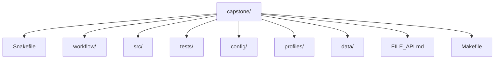

<a id="top"></a>

# Deep Dive Snakemake: Program Capstone

A compact, end-to-end Snakemake workflow that demonstrates rigorous engineering practices on toy FASTQ inputs. The biological analysis is intentionally minimal; the emphasis is on workflow correctness, reproducibility, and maintainability: explicit contracts, safe dynamic DAGs, governed configuration, versioned publishing, artifact verification, and execution across contexts (local, CI, cluster, Docker).

This project is designed to be **executed**, **studied**, and **extended** as a reference implementation.

[](https://github.com/bijux/bijux-masterclass/actions/workflows/program-validation.yml?query=branch%3Amaster)
[](https://snakemake.readthedocs.io/en/stable/)
[](https://github.com/bijux/bijux-masterclass/blob/master/LICENSE)
[](https://bijux.io/bijux-masterclass/reproducible-research/deep-dive-snakemake/)

> The CI workflow executes full confirmation runs, including workflow execution and artifact validation.

[Back to top](#top)

---

## Purpose

This capstone provides a practical reference for constructing Snakemake workflows that remain reliable at scale. It addresses common failure modes—implicit dependencies, unsafe dynamic behavior, partial outputs, configuration drift, and reproducibility gaps—through disciplined patterns:

- Early and explicit failure detection
- Clear input/output contracts and deterministic paths
- Safe handling of dynamic DAGs via checkpoints
- Strict configuration validation and modular composition
- Versioned, integrity-checked publishing
- Comprehensive testing and verification gates

The workflow is deliberately small yet complete, allowing full execution and inspection on any machine.

[Back to top](#top)

---

## Study goal

Use this capstone to answer one question repeatedly:

> If this workflow changed tomorrow, which file or boundary should absorb that change, and why?

If the program is doing its job, the answer should get clearer after each module.

[Back to top](#top)

---

## Where it fits in the program

The capstone is designed as corroboration, not as the learner's first exposure to every
concept. It is most useful once a module has already made the idea legible in a smaller
setting.

| Program area | What the capstone lets you verify |
| --- | --- |
| Modules 01-02 | truthful file contracts, dynamic discovery, and durable discovery artifacts |
| Modules 03-04 | profiles, CI-style gates, module boundaries, and executor-proof behavior |
| Modules 05-06 | software boundaries, provenance, publish surfaces, and downstream contracts |
| Modules 07-09 | repository architecture, operating-context drift, logs, benchmarks, and incident evidence |
| Module 10 | workflow review, migration, governance, and tool-boundary judgment |

If you are new to Snakemake, use this repository after you understand the module’s local
exercise or mental model. The capstone should confirm understanding, not replace first
contact teaching.

[Back to top](#top)

---

## Key Concepts Demonstrated

### Workflow Design
- Explicit rule contracts with stable filenames and directories
- Protected and temporary outputs to prevent partial artifacts
- Safe dynamic DAGs using checkpoints and proper re-evaluation
- Scatter/gather patterns for per-sample and run-level processing
- Modular rule organization with namespacing
- Clear separation of internal intermediates (`results/`) and published deliverables (`publish/vN/`)

### Operational Practices
- Execution profiles for environment-specific settings
- Structured, per-rule logging and benchmarking
- Resource declarations with resolved-value traceability
- Docker execution surface for consistent runtime

### Quality Assurance
- Schema-validated configuration as a required step
- Unit tests for pure Python components
- Artifact verification (parsing and sanity checks)
- Clean-room confirmation via Make targets

[Back to top](#top)

---

## How to study this capstone

Start in this order:

1. `Snakefile`
2. `workflow/rules/common.smk`
3. `workflow/rules/preprocess.smk`
4. `workflow/rules/summarize_report.smk`
5. `workflow/rules/publish.smk`
6. `FILE_API.md`
7. `profiles/`
8. `tests/`

That order mirrors the program: file contracts first, dynamic behavior second,
operational policy third, and publish governance last.

Run these public entrypoints from the capstone directory:

```bash
make walkthrough
make selftest
make verify-report
make tour
make confirm
```

Use `make selftest` when the narrow question is determinism across core counts rather
than full clean-room confirmation.

Use `PROOF_GUIDE.md` when you want the shortest route from a course claim to the target,
file, or published artifact that proves it.

Use `make verify-report` when you want a durable publish-contract report under
`artifacts/proof/reproducible-research/deep-dive-snakemake/verify/` rather than a single
console verdict.

[Back to top](#top)

---

## Pipeline Overview

### High-Level Stages

1. **Sample Discovery** (checkpoint)  
   Scans `data/raw/` for FASTQ files and produces a sample registry.

2. **Per-Sample Processing**  
   - Raw FASTQ quality control  
   - Adapter trimming  
   - Trimmed quality control  
   - Deduplication  
   - k-mer profiling  
   - Reference panel screening  

3. **Run-Level Aggregation**  
   - Consolidation of per-sample results into summary tables  
   - HTML report generation  

4. **Publishing**  
   - Emission of versioned outputs to `publish/v1/`  
   - Generation of a checksummed manifest for integrity verification  

[Back to top](#top)

---

## Module map into the capstone

- **Module 01** explains the explicit rule contracts, logs, benchmarks, and stable publish boundary.
- **Module 02** explains the checkpoint, deterministic discovery, provenance, and integrity artifacts.
- **Module 03** explains profiles, retries, artifact verification, and clean-room confirmation.
- **Module 04** explains module boundaries, file APIs, CI-style gates, and executor-proof semantics.
- **Module 05** explains environment files, helper-code boundaries, and provenance collection.
- **Module 06** explains `publish/v1/`, `manifest.json`, reports, and downstream-facing contracts.
- **Module 07** explains repository architecture, `workflow/rules/`, `src/capstone/`, and `FILE_API.md`.
- **Module 08** explains profiles, operating contexts, and how policy changes without changing workflow meaning.
- **Module 09** explains logs, benchmarks, workflow-tour artifacts, and incident review evidence.
- **Module 10** explains how to review the repository as a long-lived workflow product.

[Back to top](#top)

---

## Published Artifacts (Stable Interface)

Published outputs reside in `publish/v1/` and form a stable, externally consumable contract:

- `discovered_samples.json`
- `provenance.json`
- `summary.json` and `summary.tsv`
- `report/index.html`
- `manifest.json` (inventory with SHA-256 checksums)

Detailed specifications are provided in `FILE_API.md`.

Internal directories (`results/`, `logs/`, `benchmarks/`, `.snakemake/`) are not part of the stable interface.

[Back to top](#top)

---

## What to inspect during review

- Which artifacts are authoritative and which are only derived?
- Which workflow behavior changes when the executor changes, and which should not?
- Where does sample discovery become explicit and durable instead of hidden?
- Which outputs are safe for downstream consumers to trust?

[Back to top](#top)

---

## Links into the program guide

- Program site: [https://bijux.io/bijux-masterclass/reproducible-research/deep-dive-snakemake/](https://bijux.io/bijux-masterclass/reproducible-research/deep-dive-snakemake/)
- Source chapters: [`course-book/`](https://github.com/bijux/bijux-masterclass/tree/master/programs/reproducible-research/deep-dive-snakemake/course-book)
- Guided route through this repository: [`capstone-map.md`](https://github.com/bijux/bijux-masterclass/blob/master/programs/reproducible-research/deep-dive-snakemake/course-book/capstone-map.md)

[Back to top](#top)

---

## Repository Layout



Runtime-generated:
- `results/`, `logs/`, `benchmarks/`, `publish/`, `.snakemake/`

[Back to top](#top)

---

## Requirements

**Host execution**
- Python 3.11+
- Snakemake (system or virtual environment)

**Docker execution**
- Docker daemon available  
  (Designed to eliminate host Conda dependencies)

[Back to top](#top)

---

## Quick Start

### First Walkthrough
```bash
make walkthrough
```

Builds a light learner-facing bundle under `artifacts/workflow-walkthrough/` with the
repository guide, public file contract, rule list, dry-run plan, and a suggested reading
route. Use this first when you want to understand workflow shape before executing it.

### Full Clean-Room Execution with Verification
```bash
make clean verify
```

Executes the workflow from scratch and validates published artifacts (parsing, sanity, manifest integrity).

### Dry-Run Preview
```bash
make wf-dryrun
```

Displays planned jobs and commands without execution.

[Back to top](#top)

---

## Workflow Tour

Generate the executed learner-facing proof bundle:

```bash
make tour
```

This writes a stable bundle under `artifacts/workflow-tour/` containing the repository
guide, rule list, dry-run plan, execution log, summary, publish manifest, provenance
record, and a copy of the file contract. Use `make walkthrough` first when you want a
lighter orientation, then `make tour` when you want executed evidence.

[Back to top](#top)

---

## Execution via Profiles

Profiles separate workflow logic from execution context.

```bash
snakemake --profile profiles/local --cores all --configfile config/config.yaml
```

Add `-p` to print commands as they would be executed.

**Note on Checkpoints**: The sample discovery checkpoint triggers DAG re-evaluation—an expected and intentional behavior visible in dry-runs.

[Back to top](#top)

---

## Makefile Targets (Primary Interface)

| Category       | Target                  | Purpose                                                                 |
|----------------|-------------------------|-------------------------------------------------------------------------|
| Cleanup        | `make clean`            | Remove all generated state and outputs                                  |
| Formatting     | `make fmt`, `make fmt-check` | Format and validate code formatting                                |
| Linting        | `make lint`, `make check` | Static analysis and composite checks                                  |
| Testing        | `make test`, `make ci`  | Unit tests and CI-style gate                                            |
| Workflow       | `make wf-lint`          | Snakemake lint                                                          |
|                | `make wf-dryrun`        | Preview execution plan                                                  |
|                | `make wf-run`           | Execute workflow                                                        |
|                | `make walkthrough`      | Build the learner-first non-executing walkthrough bundle                |
|                | `make dag` / `make rulegraph` | Generate visualizations                                      |
| Validation     | `make validate-config`  | Schema validation                                                       |
|                | `make verify-artifacts` | Parse and sanity-check published outputs                                |
|                | `make verify`           | Full run + artifact verification                                        |
|                | `make tour`             | Build the executed workflow proof bundle                                |
|                | `make confirm`          | Strongest gate: clean + checks + tests + lint + dry-run + run + verify  |
| Docker         | `make docker-build`     | Build container image                                                   |
|                | `make docker-run`       | Execute workflow in container                                           |

**Recommendation**: Use `make confirm` for confidence before commits or releases.

[Back to top](#top)

---

## Extending the Workflow

Preserve these invariants when adding functionality:

- Deterministic outputs for identical inputs and configuration
- Explicit input/output declarations
- Temporary writes moved atomically
- Stable publish boundary (`publish/vN/`)
- Validation coverage for new artifacts

To modify the published contract, increment the version directory (e.g., `v2`) and update `FILE_API.md`.

[Back to top](#top)

---

## License

MIT — see the repository root [LICENSE](https://github.com/bijux/bijux-masterclass/blob/master/LICENSE). © 2025 Bijan Mousavi <bijan@bijux.io>.

[Back to top](#top)
