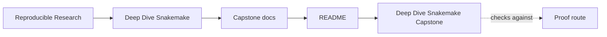
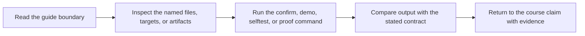

# Deep Dive Snakemake Capstone

<!-- page-maps:start -->
## Guide Maps




<!-- page-maps:end -->

Read the first diagram as the capstone shape. Read the second diagram as the entry rule:
choose the smallest route that answers the current question, then escalate only when the
question changes.

This capstone is the executable reference workflow for Deep Dive Snakemake. It turns the
course's claims about file contracts, checkpoints, profiles, publish boundaries, and
workflow review into one repository that can be inspected end to end. It is not meant to
be a first-contact playground for Snakemake syntax.

## Use this capstone when

- the module idea is already legible and you want executable corroboration
- you need one repository that keeps workflow semantics, operating policy, and published contract visible together
- you are reviewing whether a small workflow can survive CI, publish, and stewardship pressure honestly

## Do not use this capstone when

- file contracts or dynamic discovery still feel abstract
- you want to browse the whole repository before naming a question
- the strongest proof route feels safer than choosing the right one

## Choose the entry route by question

| If the question is... | Start here | Escalate only if needed |
| --- | --- | --- |
| what this repository promises | `make walkthrough` | `make tour` |
| does the workflow still hold under ordinary proof | `make verify` | `make proof` |
| what differs across execution contexts | `make profile-audit` | `make proof` |
| what is safe for downstream trust | `make verify-report` | `make confirm` |
| should I trust this as a stewardship specimen | `make proof` | `make confirm` |

From the repository root, the matching course-level commands are:

```sh
make PROGRAM=reproducible-research/deep-dive-snakemake capstone-walkthrough
make PROGRAM=reproducible-research/deep-dive-snakemake capstone-tour
make PROGRAM=reproducible-research/deep-dive-snakemake proof
```

## First honest pass

1. Run `make walkthrough`.
2. Read [INDEX.md](docs/index.md).
3. Read [WALKTHROUGH_GUIDE.md](docs/walkthrough-guide.md).
4. Read `Snakefile` and the rule files it exposes first.
5. Read [FILE_API.md](docs/file-api.md).
6. Run `make verify`.
7. Read [PROOF_GUIDE.md](docs/proof-guide.md).

Stop there first. That is enough to see the workflow contract, repository shape, and one
bounded proof route without turning the capstone into a browsing exercise.

## What the main targets prove

| Target | What it proves | Why it matters |
| --- | --- | --- |
| `walkthrough` | the learner-facing reading route is bounded and explicit | first capstone contact stays humane |
| `verify` | the workflow runs and the promoted contract is validated | proof starts from an honest repository pass |
| `tour` | the executed workflow bundle can be reviewed in one place | learners can inspect the evidence path end to end |
| `verify-report` | publish-boundary review evidence is saved as a bundle | downstream trust can be inspected later |
| `profile-audit` | local, CI, and scheduler policy differences stay explicit | policy does not get mistaken for semantics |
| `proof` | the sanctioned workflow review route exists and stays coherent | stewardship has a durable route |
| `confirm` | the strongest built-in confirmation path still passes | final review is stronger than first-pass learning |

## Repository shape

Use these surfaces deliberately:

- `Snakefile` for the workflow entrypoint
- `workflow/rules/` for rule-family contracts
- `profiles/` for operating policy
- `workflow/scripts/` and `src/capstone/` for software boundaries
- `publish/v1/` for the downstream contract
- `docs/` for bounded review routes

## Capstone docs

All capstone documentation lives under `docs/`:

- [ARCHITECTURE.md](docs/architecture.md)
- [DOMAIN_GUIDE.md](docs/domain-guide.md)
- [EXTENSION_GUIDE.md](docs/extension-guide.md)
- [FILE_API.md](docs/file-api.md)
- [INDEX.md](docs/index.md)
- [PROFILE_AUDIT_GUIDE.md](docs/profile-audit-guide.md)
- [PROOF_GUIDE.md](docs/proof-guide.md)
- [PUBLISH_REVIEW_GUIDE.md](docs/publish-review-guide.md)
- [TOUR.md](docs/tour.md)
- [WALKTHROUGH_GUIDE.md](docs/walkthrough-guide.md)

## Good stopping point

Stop when you can name:

- the current workflow question
- the smallest route that proves it
- the next stronger route only if the current one stops being enough
