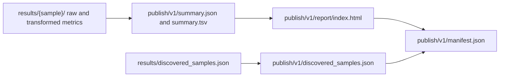

# Results Boundary Guide

<!-- page-maps:start -->
## Guide Maps

<!-- page-maps:end -->

This guide answers one high-friction question: why are some files only internal
workflow evidence while others become public publish surfaces? The capstone is much
easier to reason about when that promotion rule is explicit.

---

## Boundary Claim

`results/` is for workflow-internal evidence that helps the repository explain how it
reached an answer. `publish/v1/` is for the smaller downstream-facing contract that the
capstone is willing to version, verify, and ask another tool or human to trust.

If a file is useful only because you are debugging this repository, it probably belongs
in `results/`. If a file is stable enough that another consumer could rely on it, it
belongs in `publish/v1/`.

---

## What Stays Internal

| Internal surface | Why it stays internal |
| --- | --- |
| `results/{sample}/qc_raw.json` and `qc_trimmed.json` | detailed per-sample measurement surfaces used to build the summary |
| `results/{sample}/trim.json` and `dedup.json` | transformation evidence that matters to repository review more than downstream consumption |
| `results/{sample}/kmer.json` and `screen.json` | rich per-sample diagnostic context that feeds the stable publish summary |
| `results/discovered_samples.json` | checkpoint output that becomes public only after explicit publish promotion |

---

## What Becomes Public

| Public surface | Why it earns promotion |
| --- | --- |
| `publish/v1/discovered_samples.json` | the dynamic sample set becomes part of the downstream contract |
| `publish/v1/summary.json` and `summary.tsv` | the capstone exposes one stable per-run summary surface |
| `publish/v1/report/index.html` | the capstone exposes one compact human-readable review surface |
| `publish/v1/provenance.json` | the run identity and materialized config must travel with the publish boundary |
| `publish/v1/manifest.json` | the public boundary needs an integrity inventory |

---

## Reading Route

1. `FILE_API.md`
2. `workflow/rules/summarize_report.smk`
3. `workflow/rules/publish.smk`
4. `publish/v1/`
5. `PUBLISH_REVIEW_GUIDE.md`

---

## Review Questions

- Which file would you refuse to publish because it is still too repository-specific?
- Which internal file explains how a published field was derived?
- Which publish file would another consumer be safest to depend on first?
- Which boundary would you inspect first if someone tried to promote a new artifact?

