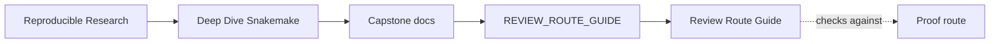
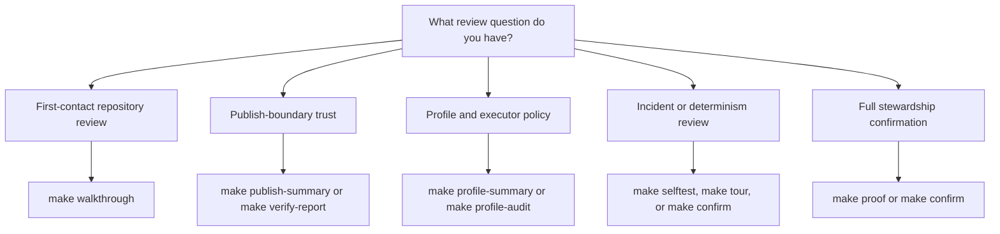

# Review Route Guide

<!-- page-maps:start -->
## Guide Maps

<!-- page-maps:end -->

This guide is the answer to one recurring learner problem: the capstone has many valid
surfaces now, but the right one depends on the question. The goal is not to use the
biggest route first. The goal is to use the smallest route that still answers the real
review question honestly.

---

## Question-To-Route Map

| If the question is... | First route | Escalate to |
| --- | --- | --- |
| what is this repository trying to do? | `DOMAIN_GUIDE.md`, then `make walkthrough` | `make tour` |
| how is the workflow divided into stages? | `WORKFLOW_STAGE_GUIDE.md` | `ARCHITECTURE.md`, `make walkthrough` |
| how does dynamic discovery work? | `CHECKPOINT_GUIDE.md`, then `make walkthrough` | `make tour` |
| which published files are safe to trust? | `make publish-summary` | `make verify-report` |
| how do profiles differ without changing meaning? | `make profile-summary` | `make profile-audit` |
| is the workflow deterministic across cores? | `make selftest` | `make confirm` |
| what happened during a real execution? | `make tour` | `make confirm` |
| where should a future change land? | `EXACT_SOURCE_GUIDE.md`, `EXTENSION_GUIDE.md` | `ARCHITECTURE.md` |
| do I need the strongest supported repository proof? | `make proof` | `make confirm` |

---

## Escalation Rules

- Prefer a guide before a command when the blocker is conceptual.
- Prefer a summary route before a bundle when the blocker is comparison.
- Prefer `walkthrough` before `tour` when execution evidence is not yet necessary.
- Prefer `proof` before `confirm` when the learner needs the sanctioned bundle rather than a full clean-room pass.
- Prefer `confirm` only when stewardship, release confidence, or full contract pressure is the actual question.

---

## Review Questions

- Are you choosing the route that answers the real question, or just the route you already know?
- Which route gives the narrowest honest answer with the least incidental complexity?
- Which bundle or artifact should exist after this route if the capstone contract is working?
- Which stronger route would you choose next only if the current one stops being sufficient?

