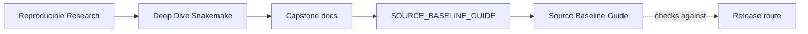
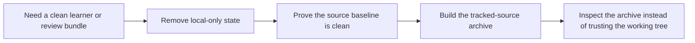

# Source Baseline Guide


<!-- page-maps:start -->
## Guide Maps




<!-- page-maps:end -->

Use this guide when you need a source artifact that reflects the tracked Snakemake
capstone rather than whatever execution residue is lying around in the working tree.

## What this guide is protecting

This capstone intentionally produces local state while you work:

- `.snakemake/` contains Snakemake runtime metadata and caches
- `publish/`, `results/`, `logs/`, and `benchmarks/` are execution outputs and evidence
- `.pytest_cache/`, `.ruff_cache/`, and `__pycache__/` are tool residue
- `dag.png` and `rulegraph.png` are local render outputs, not source

Those surfaces are useful for execution and review. They are not part of the clean
source baseline another learner should receive first.

## Source baseline workflow

Run these commands from the capstone directory:

```bash
make source-baseline-clean
make source-baseline-check
make source-bundle
```

The intent of each step is different:

- `make source-baseline-clean` removes local-only state that should never ship
- `make source-baseline-check` proves the tree is free of the known contamination paths
- `make source-bundle` writes a tracked-source archive built from `git ls-files`, so the
  result depends on tracked repository state instead of local junk

## What the source bundle includes

The source bundle includes tracked capstone files such as:

- capstone docs and review guides
- the `Snakefile`, workflow rules, modules, and scripts
- config and profile files
- tests and committed fixture data

## What the source bundle excludes

The source bundle excludes:

- workflow execution outputs
- Snakemake runtime state and caches
- tool caches and bytecode
- any other untracked or ignored working-tree files

## Best companion files

- `README.md`
- `FILE_API.md`
- `WORKFLOW_STAGE_GUIDE.md`
- `REVIEW_ROUTE_GUIDE.md`
