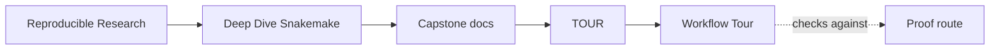
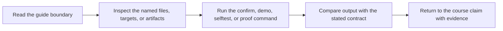

# Workflow Tour


<!-- page-maps:start -->
## Guide Maps




<!-- page-maps:end -->

This tour is the executed proof route for the Snakemake capstone. It creates a bundle
under `artifacts/workflow-tour/` so you can inspect the workflow the same way the course
asks you to reason about it: through declared rules, planned jobs, real execution,
published outputs, summary evidence, and the core interpretation guides that tell you
what each surface is supposed to settle.

If you want a lighter first step, run `make walkthrough` first. That bundle focuses on
the repository guide, rule list, dry-run plan, and public file contract without executing
the workflow.

## What the tour produces

- `list-rules.txt`: the public rule surface exposed by the workflow
- `dryrun.txt`: the planned jobs and commands without executing them
- `run.txt`: the execution log from the real workflow run
- `summary.txt`: Snakemake’s summary view after the run
- `discovered_samples.json`: the durable checkpoint artifact that fixed the dynamic sample set
- `publish-manifest.json`: the stable publish boundary inventory
- `provenance.json`: the reproducibility record for the run
- `summary.tsv` and `report/index.html`: the compact public review surfaces
- `FILE_API.md`: the documented publish contract copied into the bundle
- the core guides: domain, stage, checkpoint, publish review, incident review, profile audit, and exact source routing
- `bundle-manifest.json`: the inventory of files packaged into the review bundle itself

## How to use it

From the capstone directory:

```bash
make walkthrough
make tour
```

From the repository root:

```bash
make PROGRAM=reproducible-research/deep-dive-snakemake capstone-walkthrough
make PROGRAM=reproducible-research/deep-dive-snakemake capstone-tour
```

## What to inspect first

1. `README.md`
2. `DOMAIN_GUIDE.md` and `WORKFLOW_STAGE_GUIDE.md`
3. `list-rules.txt` and `dryrun.txt`
4. `CHECKPOINT_GUIDE.md` and `discovered_samples.json`
5. `summary.txt` and `run.txt`
6. `publish-manifest.json`, `summary.json`, `summary.tsv`, and `provenance.json`

That order mirrors the course: repository contract, rule surface, planned DAG, resulting
evidence, published interface, and reproducibility metadata.

If that route feels too broad, step back to `WALKTHROUGH_GUIDE.md`. If it feels too
narrow, continue into `PUBLISH_REVIEW_GUIDE.md` or `INCIDENT_REVIEW_GUIDE.md` depending
on the question you are reviewing.

Use `EXECUTION_EVIDENCE_GUIDE.md` when the blocker is not where the files are, but what
each executed evidence surface is actually supposed to prove.
