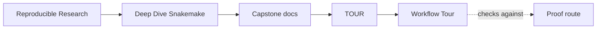
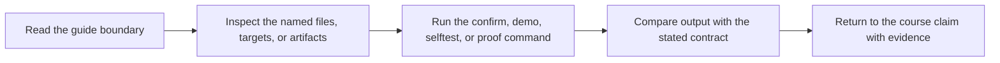

# Workflow Tour


<!-- page-maps:start -->
## Guide Maps




<!-- page-maps:end -->

This tour is the executed proof route for the Snakemake capstone. It creates a bundle
under `artifacts/workflow-tour/` so you can inspect the workflow the same way the course
asks you to reason about it: through declared rules, planned jobs, real execution,
published outputs, and summary evidence.

If you want a lighter first step, run `make walkthrough` first. That bundle focuses on
the repository guide, rule list, dry-run plan, and public file contract without executing
the workflow.

## What the tour produces

- `list-rules.txt`: the public rule surface exposed by the workflow
- `dryrun.txt`: the planned jobs and commands without executing them
- `run.txt`: the execution log from the real workflow run
- `summary.txt`: Snakemake’s summary view after the run
- `publish-manifest.json`: the stable publish boundary inventory
- `provenance.json`: the reproducibility record for the run
- `FILE_API.md`: the documented publish contract copied into the bundle
- `bundle-manifest.json`: the inventory of files packaged into the review bundle itself

## How to use it

From the capstone directory:

```bash
make walkthrough
make tour
```

From the repository root:

```bash
make PROGRAM=reproducible-research/deep-dive-snakemake capstone-walkthrough
make PROGRAM=reproducible-research/deep-dive-snakemake capstone-tour
```

## What to inspect first

1. `README.md`
2. `list-rules.txt`
3. `dryrun.txt`
4. `summary.txt`
5. `publish-manifest.json`
6. `provenance.json`

That order mirrors the course: repository contract, rule surface, planned DAG, resulting
evidence, published interface, and reproducibility metadata.
