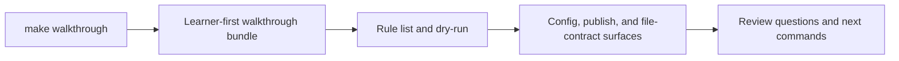

# Walkthrough Guide

<!-- page-maps:start -->
## Guide Maps

<!-- page-maps:end -->

This guide explains the lightest honest entry into the capstone. The walkthrough bundle
exists for first contact: it shows the visible rule surface, dry-run plan, policy files,
contract-enforcement scripts, and the core study guides before the learner has to reason
about full execution.

---

## When To Prefer The Walkthrough

Use `make walkthrough` when:

- you are entering the capstone for the first time
- you want to inspect the repository without executing the workflow yet
- you care about visible rule contracts more than runtime evidence

Use `make tour` later when you need executed proof artifacts.

[Back to top](#top)

---

## What The Bundle Is For

- `README.md` explains the repository contract
- `DOMAIN_GUIDE.md`, `WORKFLOW_STAGE_GUIDE.md`, and `CHECKPOINT_GUIDE.md` explain the smallest human-first story
- `Snakefile`, copied rule files, and `list-rules.txt` explain visible workflow meaning
- `dryrun.txt` explains the declared plan before execution
- copied profile and config files explain policy and validation inputs
- copied scripts explain how config and publish checks are enforced
- `CHECKPOINT_GUIDE.md` explains why dynamic discovery is visible rather than magical

[Back to top](#top)

---

## Best Review Order

1. `README.md`
2. `DOMAIN_GUIDE.md` and `WORKFLOW_STAGE_GUIDE.md`
3. `route.txt`
4. `CHECKPOINT_GUIDE.md` and `Snakefile`
5. `list-rules.txt` and `dryrun.txt`
6. `ARCHITECTURE.md`, `EXACT_SOURCE_GUIDE.md`, and `FILE_API.md`
7. `commands.txt` and `review-questions.txt`

[Back to top](#top)
