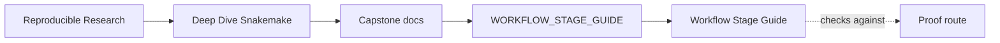
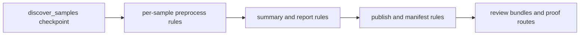

# Workflow Stage Guide

<!-- page-maps:start -->
## Guide Maps

<!-- page-maps:end -->

This guide names the workflow stages in the same order the repository executes them.
Its job is to remove one common source of capstone friction: learners can see the files,
but they still have to infer which stage owns which output and which review route proves
that stage.

---

## Stage Map

| Stage | Owning surface | Main outputs | Best first review route |
| --- | --- | --- | --- |
| discovery | `checkpoint discover_samples` in `Snakefile` | `results/discovered_samples.json`, `publish/v1/discovered_samples.json` | `make walkthrough` |
| preprocess | `workflow/rules/preprocess.smk` plus workflow modules | per-sample `results/{sample}/` QC, trim, dedup, k-mer, and screen outputs | `make walkthrough`, then `make tour` |
| summarize | `workflow/rules/summarize_report.smk` | `publish/v1/summary.json`, `publish/v1/summary.tsv`, `publish/v1/report/index.html` | `make tour` |
| publish | `workflow/rules/publish.smk`, `FILE_API.md`, `scripts/verify_publish.py` | `publish/v1/manifest.json`, publish verification evidence | `make verify-report` |
| operate | `profiles/`, `config/`, `Makefile` | dry-runs, profile audit bundle, clean-room confirmation | `make profile-audit`, `make confirm` |

---

## What Each Stage Must Prove

- discovery must prove that sample discovery is explicit, durable, and reviewable.
- preprocess must prove that per-sample transformations have visible rule contracts.
- summarize must prove that many per-sample files collapse into one stable public summary.
- publish must prove that downstream trust comes from a versioned contract, not directory luck.
- operate must prove that execution policy changes do not silently change workflow meaning.

---

## Reading Route By Stage

1. `Snakefile` for discovery and top-level assembly
2. `workflow/rules/preprocess.smk` for per-sample contracts
3. `workflow/rules/summarize_report.smk` for run-level aggregation
4. `workflow/rules/publish.smk` and `FILE_API.md` for the public boundary
5. `profiles/`, `config/`, and `Makefile` for operating policy

---

## Review Questions

- Which stage would you inspect first if a new sample appeared unexpectedly?
- Which stage would you inspect first if the report changed but per-sample outputs looked stable?
- Which stage is allowed to change execution policy without changing analytical meaning?
- Which stage is the highest-risk boundary for downstream trust?

