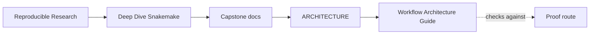
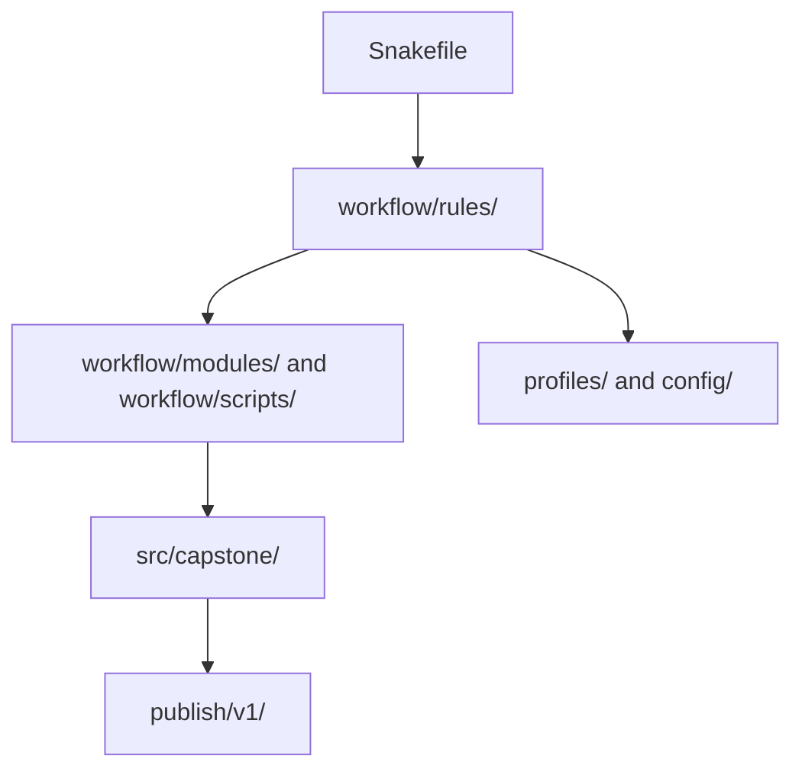

# Workflow Architecture Guide

<!-- page-maps:start -->
## Guide Maps

<!-- page-maps:end -->

This guide explains how the capstone is partitioned and why those partitions matter. The
workflow is small enough to execute fully, but large enough that a learner can still get
lost if the ownership of each layer is not made explicit.

---

## Architecture Claim

The repository should keep four responsibilities separate:

- workflow orchestration and file contracts
- reusable implementation code
- execution policy and operating context
- published artifacts and downstream trust

If those responsibilities blur together, the repository becomes harder to review than the
course is claiming it should be.

---

## Layer Route

Read the architecture in this order:

1. `Snakefile`
2. `workflow/rules/`
3. `workflow/modules/` and `workflow/scripts/`
4. `src/capstone/`
5. `profiles/` and `config/`
6. `publish/v1/` and [File API](FILE_API.md)

That route moves from visible workflow assembly, to rule families, to helper boundaries,
to reusable code, to operating policy, and finally to the downstream contract.

---

## What Each Layer Owns

| Layer | Owns | Must not absorb |
| --- | --- | --- |
| `Snakefile` | visible workflow assembly and public target surface | hidden implementation detail that makes the DAG harder to read |
| `workflow/rules/` | rule contracts, declared inputs and outputs, logs, benchmarks | helper logic that belongs in scripts or Python packages |
| `workflow/modules/` and `workflow/scripts/` | reusable workflow fragments and orchestration-adjacent helpers | silently changing workflow meaning outside declared contracts |
| `src/capstone/` | reusable processing logic with tests | execution policy or publish semantics that belong to the workflow |
| `profiles/` and `config/` | operating policy and validated configuration inputs | analytical meaning or hidden behavior |
| `publish/v1/` | downstream-facing public contract | internal execution detail or transient workflow state |

---

## Review Questions

- If a new sample-processing step appeared tomorrow, which layer should own the change?
- If an executor changed from local to cluster, which layer should stay semantically stable?
- If a downstream consumer relied on one file, which layer proves that trust boundary?
- Which layer would be the first warning sign if the repository started to hide workflow truth?

Use [Review Route Guide](REVIEW_ROUTE_GUIDE.md) when the architecture answer still feels
too broad and you need the smallest next route for one concrete question.
Use [Walkthrough Guide](WALKTHROUGH_GUIDE.md) when the confusion is specifically about
the visible workflow layers before execution.

