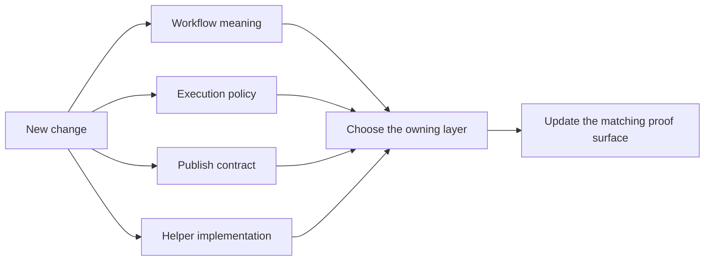
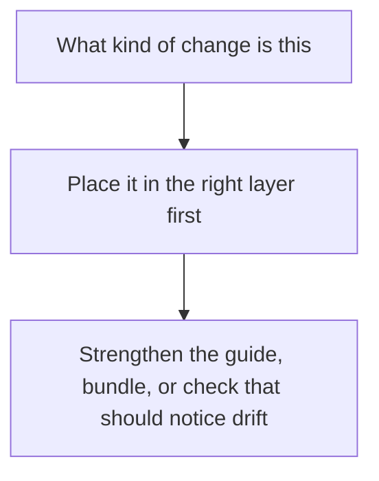

# Extension Guide

<!-- page-maps:start -->
## Guide Maps

<!-- page-maps:end -->

Use this guide when a change seems reasonable in more than one place. The main job is to
keep ownership obvious a year later: workflow meaning in workflow files, policy in
profiles or config, reusable code in code, and public trust changes in the publish
contract.

---

## If the change affects workflow meaning

Prefer:

- `Snakefile`
- `workflow/rules/`
- `workflow/modules/`

Also update:

- [Walkthrough Guide](WALKTHROUGH_GUIDE.md) or [Architecture Guide](ARCHITECTURE.md) if a
  new reader should notice it
- `make walkthrough` or `make tour` evidence if the visible route changed

[Back to top](#top)

---

## If the change affects execution policy

Prefer:

- `profiles/`
- validated config under `config/`

Also update:

- [Profile Audit Guide](PROFILE_AUDIT_GUIDE.md)
- `make profile-audit` expectations

If the change would alter analytical meaning, it does not belong here.

[Back to top](#top)

---

## If the change affects the public publish contract

Prefer:

- `FILE_API.md`
- publish rules
- verification surfaces such as `verify-report`

Also update:

- [Publish Review Guide](PUBLISH_REVIEW_GUIDE.md)
- compatibility expectations and versioning decisions

Treat this as a trust-boundary change, not a convenience edit.

[Back to top](#top)

---

## If the change affects helper implementation

Prefer:

- `workflow/scripts/` for orchestration-adjacent helpers
- `src/capstone/` for reusable implementation code with clearer software boundaries

Also update:

- the tests or verification surfaces that would catch drift in that helper

Do not let helper code become the only place where workflow meaning can be found.

[Back to top](#top)

---

## Final ownership test

Before merging a change, ask:

1. would another maintainer know where this belongs without reading the diff twice
2. which guide or audit bundle should mention it
3. which route would fail first if this change drifted later

[Back to top](#top)
