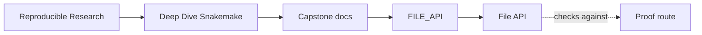
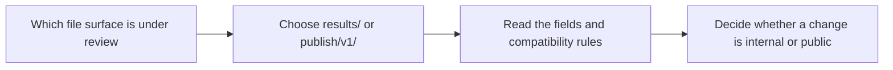

# File API

<!-- page-maps:start -->
## Guide Maps

<!-- page-maps:end -->

This page describes the file surfaces a reviewer is expected to care about. The key
distinction is simple: `results/` is workflow-owned internal state; `publish/v1/` is the
public downstream contract.

Use `PUBLISH_REVIEW_GUIDE.md` when the question is whether the public contract deserves
trust. Use this page when the question is exactly which files and fields that contract
contains.

## Compatibility rules

All published JSON files:

- are UTF-8
- end with a newline
- are deterministic in key ordering where applicable
- carry `schema_version`

Treat a path rename, field removal, or semantic change in `publish/v1/` as a public
contract change. Treat changes under `results/` as workflow-internal unless another rule
or guide promotes them explicitly.

## Internal workflow surfaces: `results/{sample}/`

Each sample owns a directory under `results/{sample}/`. These files are stable enough for
the workflow itself to depend on, but they are not the downstream public API.

| File | What it records |
| --- | --- |
| `qc_raw.json` / `qc_trimmed.json` | read counts, base counts, GC/N fractions, quality summaries, and length histograms |
| `trim.json` | trimming input/output counts, parameters, and clipping totals |
| `dedup.json` | deduplication mode, counts, key, and duplicates dropped |
| `kmer.json` | k-mer signature inputs, counts, and representative signature surfaces |
| `screen.json` | panel-screen inputs and sorted hit scores |

## Published downstream contract: `publish/v1/`

These are the files another consumer is allowed to trust as the public output surface.

| File | Why it exists |
| --- | --- |
| `discovered_samples.json` | records the checkpoint-resolved sample set used by the run |
| `summary.json` | machine-friendly merged per-sample summary surface |
| `summary.tsv` | compact tabular review surface for humans and tools |
| `report/index.html` | static human-facing report |
| `provenance.json` | records runtime, platform, Snakemake version, git commit when available, and materialized config |
| `manifest.json` | ordered inventory of published files and their hashes |

## Boundary tests

Ask these before changing a file:

1. is this file consumed by the workflow itself, by a downstream user, or both
2. would this change require a version bump because another consumer could break
3. is this path part of publish trust, or only execution evidence
4. should the change be corroborated by `verify-report`

## Companion guides

- `PUBLISH_REVIEW_GUIDE.md`
- `RESULTS_BOUNDARY_GUIDE.md`
- `PROOF_GUIDE.md`
