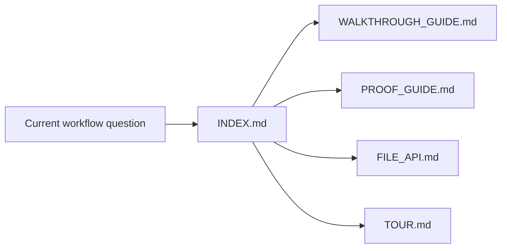
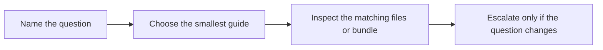

# Capstone Index

<!-- page-maps:start -->
## Guide Maps

<!-- page-maps:end -->

Use this page as the stable entry route for the Snakemake capstone docs.

## Start here by question

| If the question is... | Start here | Escalate only if needed |
| --- | --- | --- |
| what repository story and workflow are being modeled | `DOMAIN_GUIDE.md` | `WALKTHROUGH_GUIDE.md` and `ARCHITECTURE.md` |
| how the visible workflow is assembled before execution | `WALKTHROUGH_GUIDE.md` | `make walkthrough` and `TOUR.md` |
| what files are safe for downstream trust | `FILE_API.md` | `PUBLISH_REVIEW_GUIDE.md` and `make verify-report` |
| how profile differences stay operational | `PROFILE_AUDIT_GUIDE.md` | `make profile-audit` |
| how to route one claim to evidence quickly | `PROOF_GUIDE.md` | `TOUR.md` and `make proof` |
| where a future change should land | `EXTENSION_GUIDE.md` | `ARCHITECTURE.md` and `make walkthrough` |

## Stable local doc surface

- `ARCHITECTURE.md`
- `DOMAIN_GUIDE.md`
- `EXTENSION_GUIDE.md`
- `FILE_API.md`
- `INDEX.md`
- `PROFILE_AUDIT_GUIDE.md`
- `PROOF_GUIDE.md`
- `PUBLISH_REVIEW_GUIDE.md`
- `TOUR.md`
- `WALKTHROUGH_GUIDE.md`
