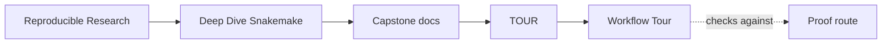
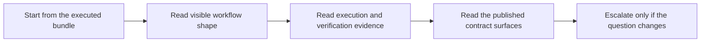

# Workflow Tour

<!-- page-maps:start -->
## Guide Maps

<!-- page-maps:end -->

This tour is the executed proof route for the Snakemake capstone. It creates a bundle
under `artifacts/tour/reproducible-research/deep-dive-snakemake/` so you can inspect the
workflow through declared rules, planned jobs, actual execution, published outputs, and
the guides that explain what each surface should settle.

If the workflow has not been run yet, start with `make walkthrough` instead.

## What the tour produces

- `list-rules.txt` for the visible rule surface
- `dryrun.txt` for the planned jobs before execution
- `run.txt` for the real workflow execution log
- `summary.txt` for Snakemake's post-run summary
- `verify.txt` for publish verification output
- `discovered_samples.json` for the durable checkpoint-resolved sample set
- `publish-manifest.json`, `summary.json`, `summary.tsv`, `provenance.json`, and `report/index.html` for the published contract
- copied guides for domain, walkthrough, publish trust, profile drift, proof routing, architecture, and extension ownership
- `bundle-manifest.json` for the inventory of the tour bundle itself

## Good first reading order

1. `README.md`
2. `INDEX.md`, `DOMAIN_GUIDE.md`, and `WALKTHROUGH_GUIDE.md`
3. `list-rules.txt` and `dryrun.txt`
4. `discovered_samples.json`, `Snakefile`, and `dryrun.txt`
5. `summary.txt`, `run.txt`, and `verify.txt`
6. `publish-manifest.json`, `summary.json`, `summary.tsv`, `provenance.json`, and `report/index.html`

That order keeps declared workflow meaning ahead of executed evidence, and executed
evidence ahead of downstream trust.

## When to step out of the tour

- use `PUBLISH_REVIEW_GUIDE.md` when the question is specifically downstream trust
- use `PROFILE_AUDIT_GUIDE.md` when the question is profile or executor drift
- use `PROOF_GUIDE.md` when the question is determinism or route selection
- use `EXTENSION_GUIDE.md` when you know the question but not the owning layer
