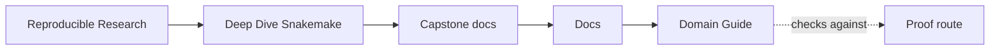
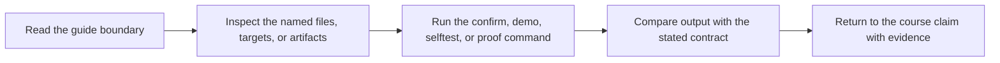

# Domain Guide

<!-- page-maps:start -->
## Guide Maps

<!-- page-maps:end -->

This guide keeps the biological domain small enough for the workflow lesson to stay
legible. The capstone is not teaching genomics in full. It is teaching how a
Snakemake workflow stays reviewable while moving a small sequencing dataset through a
clear series of contracts.

---

## Domain Claim

The domain story is intentionally narrow:

- each sample starts as a compressed FASTQ file
- the workflow measures basic quality before and after trimming
- duplicate reads are removed or copied according to policy
- a compact k-mer signature is compared with a tiny reference panel
- the publish boundary exposes the discovered samples, summarized metrics, report, provenance, and manifest

If you can explain that story in one minute, you already know enough biology to study
the workflow honestly.

---

## What Each Step Means

| Step | Human meaning | Why the workflow cares |
| --- | --- | --- |
| raw FASTQ | sequencing reads exactly as they arrived | this is the input contract and discovery surface |
| raw QC | count reads, bases, read lengths, and base quality | proves what arrived before any mutation |
| trimming | remove adapters, low-quality tails, and unacceptable reads | makes cleanup rules explicit instead of hidden |
| trimmed QC | measure the result after cleanup | shows whether the cleanup changed the sample as expected |
| dedup | collapse repeated reads or copy them through | makes duplicate policy visible and configurable |
| k-mer profile | summarize the sequence content compactly | creates a stable review surface for panel comparison |
| panel screen | compare the sample signature with known references | gives the workflow a small, human-readable end result |
| published summary | combine per-sample evidence into one public surface | gives downstream review one stable contract to trust |

---

## Small Vocabulary

- `FASTQ`: a text format that stores reads and per-base quality scores.
- `QC`: quality control, meaning simple measurements that describe read quality and composition.
- `adapter`: known sequence content that should be removed from reads.
- `dedup`: duplicate handling, usually removing repeated reads created during preparation or sequencing.
- `k-mer`: a sequence fragment of fixed length used as a lightweight signature.
- `panel`: a small reference set used here only for comparison, not for real biological diagnosis.

---

## What The Capstone Is Not Claiming

- It is not claiming clinically meaningful interpretation.
- It is not claiming high-performance bioinformatics.
- It is not claiming realistic production-scale genomics.

The workflow is deliberately toy-sized so you can focus on workflow truth:
checkpoint discovery, rule contracts, publish boundaries, profile policy, and
reviewable evidence.

---

## Best Next Files

1. `Snakefile` for the visible workflow assembly
2. [Walkthrough Guide](walkthrough-guide.md) for the lightest honest entry route
3. [File API](file-api.md) for the public publish boundary
4. [Proof Guide](proof-guide.md) when you want the shortest route from a claim to evidence
