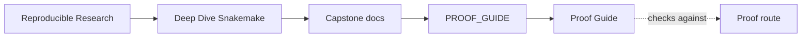
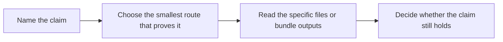

# Proof Guide

<!-- page-maps:start -->
## Guide Maps

<!-- page-maps:end -->

Use this guide when you know the question you want answered and need the shortest honest
route from that question to evidence. Most review work does not need the strongest route
first.

## Start from the claim

| Claim | Smallest honest route | Read these first |
| --- | --- | --- |
| fresh-machine setup is explicit and repeatable | `make bootstrap-confirm` | `Makefile`, `environment.yaml`, toolchain output under `artifacts/venv/` |
| rule contracts are visible before execution | `make walkthrough` | `Snakefile`, `workflow/rules/*.smk`, `list-rules.txt`, `dryrun.txt` |
| checkpoint discovery is explicit rather than magical | `make walkthrough` | [Walkthrough Guide](walkthrough-guide.md), `Snakefile`, `discovered_samples.json` after execution |
| the published boundary is stable and reviewable | `make verify-report` | [File API](file-api.md), `verify.json`, `manifest.json`, `provenance.json` |
| profile differences stay operational instead of semantic | `make profile-audit` | `profiles/*/config.yaml`, dry-run comparisons, [Profile Audit Guide](profile-audit-guide.md) |
| the workflow stays deterministic across core counts | `make selftest` | `tests/selftest.sh`, published summaries under `publish/v1/` |
| executed evidence can be reviewed in one place | `make tour` | `run.txt`, `summary.txt`, published artifacts, [TOUR.md](tour.md) |
| one sanctioned multi-bundle proof route exists | `make proof` | `tour`, `verify-report`, and `profile-audit` bundles |
| the full repository contract still survives clean-room pressure | `make confirm` | `Makefile`, `tests/`, `publish/v1/`, profile surfaces |

## Route selection rules

- choose `walkthrough` for first contact
- choose `verify-report` for publish-boundary trust
- choose `profile-audit` for policy and executor questions
- choose `selftest` for determinism questions
- choose `tour` for executed evidence
- choose `proof` only when one review question now spans several bundles
- choose `confirm` when stewardship review needs the strongest supported route

## Good reading order

1. `README.md`
2. [Domain Guide](domain-guide.md)
3. `Snakefile`
4. `workflow/rules/common.smk`
5. `workflow/rules/publish.smk`
6. [File API](file-api.md)

That route keeps contract and published trust ahead of implementation detail.
