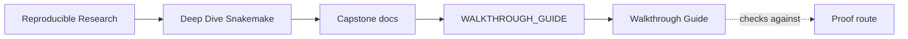
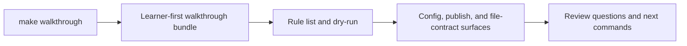

# Walkthrough Guide

<!-- page-maps:start -->
## Guide Maps

<!-- page-maps:end -->

This guide explains the lightest honest entry into the capstone. The walkthrough bundle
exists for first contact: it shows the visible rule surface, dry-run plan, policy files,
contract-enforcement scripts, and the core study guides before you have to reason
about full execution.

---

## When To Prefer The Walkthrough

Use `make walkthrough` when:

- you are entering the capstone for the first time
- you want to inspect the repository without executing the workflow yet
- you care about visible rule contracts more than runtime evidence

Use `make tour` later when you need executed proof artifacts.

---

## What The Bundle Is For

- [Domain Guide](domain-guide.md) and [Architecture Guide](architecture.md) explain the
  smallest human-first story
- `Snakefile`, copied rule files, and `list-rules.txt` explain visible workflow meaning
- `dryrun.txt` explains the declared plan before execution
- copied profile and config files explain policy and validation inputs
- copied scripts explain how config and publish checks are enforced
- [index.md](index.md) and [File API](file-api.md) explain which route or contract to
  inspect next

---

## Best Review Order

1. `README.md`
2. [Domain Guide](domain-guide.md) and [Architecture Guide](architecture.md)
3. `route.txt`
4. `Snakefile` and `list-rules.txt`
5. `list-rules.txt` and `dryrun.txt`
6. [File API](file-api.md) and [index.md](index.md)
7. `commands.txt` and `review-questions.txt`
