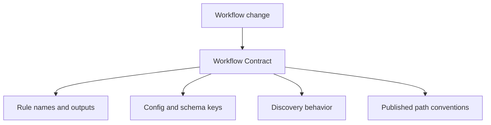
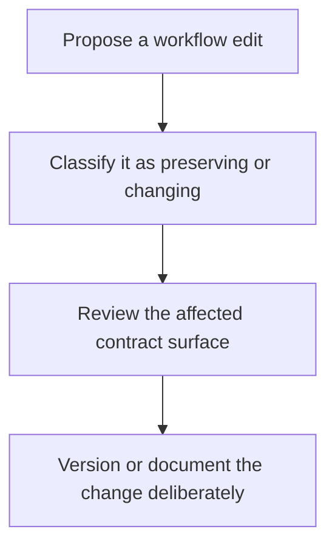

# Workflow Contract

This file describes the boundaries that keep workflow meaning reviewable.

## What belongs in the workflow contract

The workflow contract includes:

- rule names and their declared outputs
- path conventions under `results/` and `publish/v1/`
- config keys loaded from `config/config.yaml`
- schema enforcement through `config/schema.yaml`
- discovery behavior recorded in `results/discovered_samples.json`
- module composition under `workflow/rules/` and `workflow/modules/`

If one of those surfaces changes, the workflow meaning may have changed and review should
start here.

## What does not belong in the workflow contract

The workflow contract does not include:

- executor choice and scheduling policy in `profiles/`
- local caches or runtime state under `.snakemake/`
- transient logs or benchmark files used only for diagnosis
- ad hoc shell flags that are not written into version-controlled files

Those surfaces affect operation, not the analytical meaning of the DAG.

## Change categories

### Contract-preserving changes

- refactoring implementation details without changing outputs
- adding internal evidence files that no downstream rule depends on
- tightening validation without changing valid input meaning

### Contract-changing changes

- renaming published outputs
- changing JSON field meaning or removing existing fields
- changing sample discovery semantics
- moving an existing output to a new directory
- changing which config keys are required for a successful run

Contract-changing edits should be accompanied by updated docs and a deliberate version
decision for the affected surface.

## Review starting points

- `workflow/contracts/FILE_API.md` for path-level promises
- `workflow/REVIEW.md` for the evidence checklist
- `../CONFIG_CONTRACT_GUIDE.md` for config truth and materialization
- `../PROFILE_AUDIT_GUIDE.md` for executor-policy review
