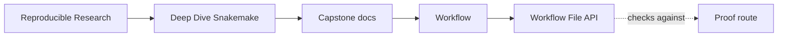
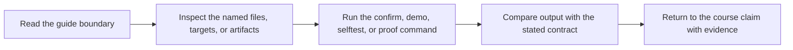
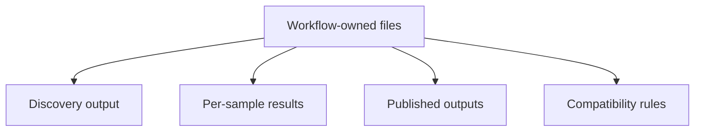
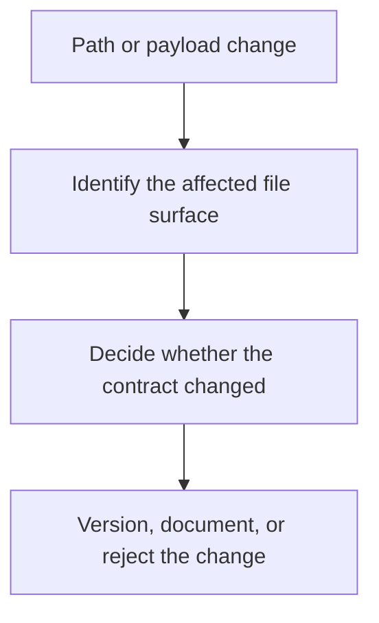

# Workflow File API

<!-- page-maps:start -->
## Guide Maps

<!-- page-maps:end -->

This guide records the workflow-owned file surfaces that other rules are allowed to rely
on. It exists so contract questions can be answered inside the workflow tree, not only
from the top-level capstone review docs.

Use the top-level `FILE_API.md` when the question is downstream publish trust. Use this
guide when the question is which paths a workflow change is allowed to read or write.

## Stable workflow surfaces

### Discovery

- `results/discovered_samples.json` is the durable output of checkpoint discovery
- downstream rules may consume the recorded sample set, but they should not rediscover
  raw files on their own

### Per-sample results

Each sample owns a directory under `results/{sample}/`.

- `trimmed.fastq.gz`
- `dedup.fastq.gz`
- `qc_raw.json`
- `qc_raw.tsv`
- `trim.json`
- `qc_trimmed.json`
- `qc_trimmed.tsv`
- `dedup.json`
- `kmer.json`
- `screen.json`

Rules may rely on those filenames and on their per-sample ownership boundary. A change
that renames, removes, or merges those surfaces is a workflow contract change.

### Published outputs

The workflow promotes a smaller public boundary under `publish/v1/`.

- `manifest.json`
- `discovered_samples.json`
- `summary.json`
- `summary.tsv`
- `provenance.json`
- `report/index.html`

Changes to published path names or semantics require an intentional version change to the
publish boundary.

## Compatibility rules

- Keep internal intermediates under `results/`; do not let downstream review depend on
  hidden scratch files in `.snakemake/`, `logs/`, or `benchmarks/`
- Keep publish semantics versioned under `publish/vN/`
- Prefer adding fields over removing them when a JSON surface already exists
- Treat a path rename as a contract change even when the payload format is unchanged

## Best companion files

- `workflow/CONTRACT.md`
- `workflow/REVIEW.md`
- `../../FILE_API.md`
- `../../PUBLISH_REVIEW_GUIDE.md`
