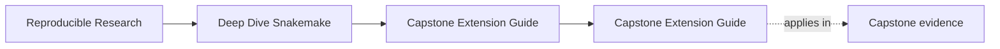
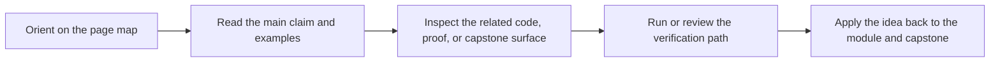

# Capstone Extension Guide

<!-- page-maps:start -->
## Page Maps

<!-- page-maps:end -->

Use this guide when changing the Snakemake capstone after the course is already in use.

The goal is not to forbid growth. The goal is to keep new work from weakening the rule
contracts, policy boundaries, publish surface, and review evidence the course depends on.

---

## Boundaries That Must Stay Legible

These boundaries should remain explicit:

* rule contracts versus helper implementation code
* dynamic discovery versus hidden side effects
* operating policy versus workflow meaning
* internal execution state versus `publish/v1/`

[Back to top](#top)

---

## Safe Kinds Of Change

These changes are usually safe when reviewed carefully:

* adding a new internal rule with explicit inputs, outputs, and logs
* enriching the publish bundle without breaking existing promoted files
* extending profiles while keeping their meaning operational rather than semantic
* strengthening walkthrough, tour, or verification evidence

[Back to top](#top)

---

## Risky Kinds Of Change

These changes need stronger review:

* changing the meaning of an existing published artifact
* adding a checkpoint that hides moving targets instead of recording them
* moving analytical meaning into profile or executor-specific settings
* adding repository structure that buries the visible rule graph under indirection

The local companion for this page is `capstone/EXTENSION_GUIDE.md`. Use it when you want
the capstone itself to answer where the next change belongs.

[Back to top](#top)

---

## Minimum Proof After A Change

After any meaningful capstone change, rerun:

1. `make -C capstone walkthrough`
2. `make -C capstone wf-dryrun`
3. `make -C capstone verify`
4. `make -C capstone tour`

If any of those results become harder to explain, the repository likely got worse even if
it still runs.

[Back to top](#top)

---

## Best Companion Pages

Use these pages with this guide:

* [`repository-layer-guide.md`](repository-layer-guide.md)
* [`capstone-file-guide.md`](capstone-file-guide.md)
* [`capstone-review-worksheet.md`](capstone-review-worksheet.md)
* [`proof-matrix.md`](proof-matrix.md)

[Back to top](#top)
