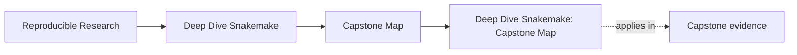
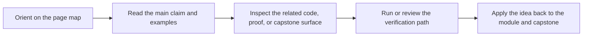

# Deep Dive Snakemake: Capstone Map

<!-- page-maps:start -->
## Page Maps

<!-- page-maps:end -->

The capstone is the executable cross-check for this program, but it should not be the
first teaching surface for every concept. This page gives you one clear route through the
repository so you know when to enter it, what to inspect, and which command proves the
idea you are studying.

---

## Recommended Entry Rule

Use the capstone lightly in Module 01, heavily in Modules 02-09, and as a workflow review
specimen in Module 10.

If a concept still feels abstract, return to the smaller module exercise first. The
capstone should confirm understanding, not replace first-contact learning.

---

## Module-to-Capstone Route

| Module | Learner goal | Capstone surfaces | Proof command |
| --- | --- | --- | --- |
| 01 First Principles | understand truthful file contracts and stable targets | `Snakefile`, `workflow/rules/common.smk`, `publish/v1/` | `make -C capstone walkthrough` |
| 02 Dynamic DAGs | see checkpoint discovery become explicit and durable | `Snakefile`, `results/discovered_samples.json`, `publish/v1/discovered_samples.json` | `make -C capstone wf-run` |
| 03 Production Operation | inspect policy surfaces and clean-room confirmation | `profiles/`, `Makefile`, `tests/selftest.sh` | `make -C capstone confirm` |
| 04 Scaling Patterns | inspect modular rule files and repository interfaces | `workflow/rules/`, `FILE_API.md`, `TOUR.md` | `make -C capstone tour` |
| 05 Rule Boundaries | inspect environments, helper code, and script boundaries | `workflow/envs/python.yaml`, `workflow/scripts/provenance.py`, `src/capstone/` | `make -C capstone test` |
| 06 Publish Contracts | inspect stable outputs, manifests, and reports | `publish/v1/`, `workflow/rules/publish.smk`, `FILE_API.md` | `make -C capstone verify-artifacts` |
| 07 Workflow Architecture | review how rules, helpers, and file APIs are split | `Snakefile`, `workflow/rules/`, `src/capstone/`, `FILE_API.md` | `snakemake --directory capstone --list-rules` |
| 08 Operating Contexts | compare local, CI, and scheduler-oriented policy | `profiles/local/`, `profiles/ci/`, `profiles/slurm/`, `Makefile` | `snakemake --directory capstone --profile profiles/local -n` |
| 09 Incident Response | inspect logs, benchmarks, and workflow-tour artifacts as evidence | `logs/`, `benchmarks/`, `artifacts/workflow-tour/`, tests | `make -C capstone tour` |
| 10 Mastery | review the whole repository as a long-lived workflow product | `Snakefile`, `FILE_API.md`, `profiles/`, `tests/`, `Makefile` | `make -C capstone info && make -C capstone wf-dryrun` |

When the main question is repository ownership rather than a single module idea, use
`capstone/ARCHITECTURE.md` first and then return to the row that matches your current module.

[Back to top](#top)

---

## First Capstone Tour

If you want one sane first walkthrough, use this order:

1. Run `make -C capstone walkthrough` to generate the learner-first reading bundle.
2. Read `Snakefile` to see the entrypoint and default target.
3. Read `workflow/rules/common.smk` and then the rule-family files.
4. Read `FILE_API.md` to see what downstream consumers are actually allowed to trust.
5. Run `make -C capstone tour` and then `make -C capstone verify` when you want executed proof.

This order keeps contract and repository shape ahead of implementation detail.

Use [Capstone Walkthrough](capstone-walkthrough.md) when you want the course-book version
of that same first-contact route.

[Back to top](#top)

---

## Fast Routes by Goal

| Goal | Start here | Then inspect |
| --- | --- | --- |
| Why did this workflow plan these jobs? | `make -C capstone wf-dryrun` | `Snakefile`, `workflow/rules/` |
| Where does dynamic discovery become explicit? | `make -C capstone wf-run` | `results/discovered_samples.json`, `publish/v1/discovered_samples.json` |
| What is the stable downstream contract? | `make -C capstone verify-artifacts` | `publish/v1/`, `FILE_API.md` |
| How are policy and semantics separated? | inspect `profiles/` | `Makefile`, `Snakefile` |
| Where do helper-code boundaries live? | inspect `src/capstone/` | `workflow/scripts/`, `workflow/envs/` |
| How would I review this workflow before migration? | `make -C capstone tour` | `FILE_API.md`, `profiles/`, `tests/`, `Makefile` |

Use [Capstone Architecture Guide](capstone-architecture-guide.md) when the review question
is about repository layers rather than about one output or command.

Use [Capstone Proof Guide](capstone-proof-guide.md) when you want help choosing the
narrowest honest proof route before you run anything.

[Back to top](#top)

---

## Capstone Discipline

Use the capstone well:

* read the module first, then verify in the capstone
* prefer commands and files over vague summaries
* inspect one boundary question at a time
* treat the workflow tour and verification targets as review evidence, not decoration

If the repository ever starts to feel bigger than the concept you are studying, step back
to the module and return once the smaller exercise has made the idea legible again.

[Back to top](#top)
