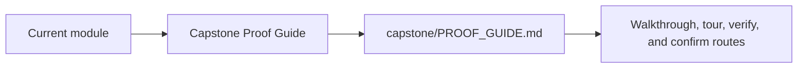
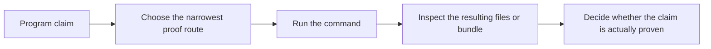

# Capstone Proof Guide

<!-- page-maps:start -->
## Page Maps

<!-- page-maps:end -->

Use this page when a module makes a Snakemake design claim and you want the shortest
honest route to the capstone evidence that supports it.

---

## Recommended Route

1. Read `capstone/PROOF_GUIDE.md`.
2. Use [Proof Matrix](proof-matrix.md) to choose the narrowest command.
3. Run that command from the capstone or course root.
4. Use [Capstone Review Worksheet](capstone-review-worksheet.md) to record what the evidence actually proves.

[Back to top](#top)

---

## Strongest Default Routes

- `make -C capstone walkthrough` when you want first-contact evidence without execution
- `make -C capstone tour` when you want executed workflow proof
- `make -C capstone verify-report` when you want publish-boundary review
- `make -C capstone profile-audit` when you want execution-policy review
- `make -C capstone confirm` when you want clean-room contract confirmation

[Back to top](#top)

---

## What A Good Proof Review Can Answer

- which command gives the narrowest honest answer to the question you have
- which files are proving workflow meaning versus publish trust versus operating policy
- when a broader route is necessary because the narrower route is no longer enough

[Back to top](#top)
