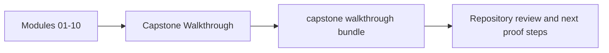
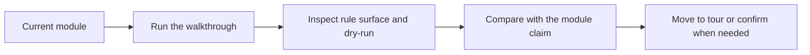

# Capstone Walkthrough

<!-- page-maps:start -->
## Page Maps

<!-- page-maps:end -->

Use this page when you want the capstone as a guided first-contact repository tour rather
than as a fully executed proof bundle.

---

## Recommended Route

1. Read `capstone/WALKTHROUGH_GUIDE.md`.
2. Run `make PROGRAM=reproducible-research/deep-dive-snakemake capstone-walkthrough`.
3. Read the copied `Snakefile`, rule files, `list-rules.txt`, and `dryrun.txt` in that order.
4. Use [Capstone Review Worksheet](capstone-review-worksheet.md) to write down what is visible before execution.

[Back to top](#top)

---

## What The Walkthrough Should Teach

- what the workflow claims to build before it runs
- where dynamic discovery is declared rather than hidden
- which files are public contracts and which files are only review aids
- which next command should deepen the review once first contact is clear

[Back to top](#top)
