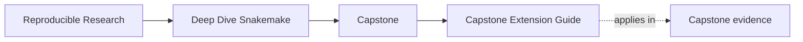
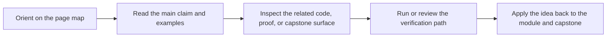

# Capstone Extension Guide

<!-- page-maps:start -->
## Page Maps

<!-- page-maps:end -->

Read the first diagram as a timing map: this guide is for a named pressure, not for wandering the whole course-book. Read the second diagram as the guide loop: arrive with a concrete question, use only the matching sections, then leave with one smaller and more honest next move.

Use this guide when changing the Snakemake capstone after the course is already in use.

The goal is not to forbid growth. The goal is to keep new work from weakening the rule
contracts, policy boundaries, publish surface, and review evidence the course depends on.

---

## Boundaries That Must Stay Legible

These boundaries should remain explicit:

* rule contracts versus helper implementation code
* dynamic discovery versus hidden side effects
* operating policy versus workflow meaning
* internal execution state versus `publish/v1/`

---

## Safe Kinds Of Change

These changes are usually safe when reviewed carefully:

* adding a new internal rule with explicit inputs, outputs, and logs
* enriching the publish bundle without breaking existing promoted files
* extending profiles while keeping their meaning operational rather than semantic
* strengthening walkthrough, tour, or verification evidence

---

## Risky Kinds Of Change

These changes need stronger review:

* changing the meaning of an existing published artifact
* adding a checkpoint that hides moving targets instead of recording them
* moving analytical meaning into profile or executor-specific settings
* adding repository structure that buries the visible rule graph under indirection

The best companion for this page is [Capstone File Guide](capstone-file-guide.md). Use it when you want
the capstone reading order to answer where the next change belongs.

---

## Minimum Proof After A Change

After any meaningful capstone change, rerun:

1. `make PROGRAM=reproducible-research/deep-dive-snakemake capstone-walkthrough`
2. `make PROGRAM=reproducible-research/deep-dive-snakemake capstone-wf-dryrun`
3. `make PROGRAM=reproducible-research/deep-dive-snakemake capstone-verify-report`
4. `make PROGRAM=reproducible-research/deep-dive-snakemake capstone-tour`

If any of those results become harder to explain, the repository likely got worse even if
it still runs.

---

## Best Companion Pages

Use these pages with this guide:

* [`architecture.md`](../capstone/docs/architecture.md)
* [`capstone-file-guide.md`](capstone-file-guide.md)
* [`capstone-review-worksheet.md`](capstone-review-worksheet.md)
* [`proof-matrix.md`](../guides/proof-matrix.md)
