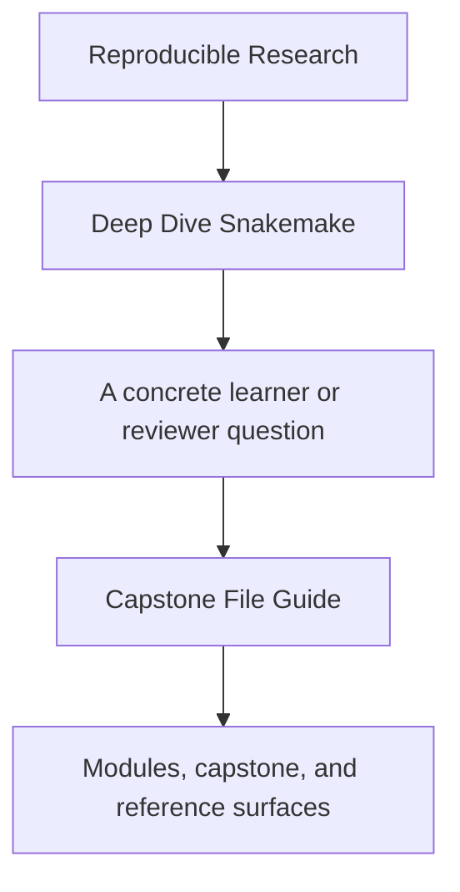
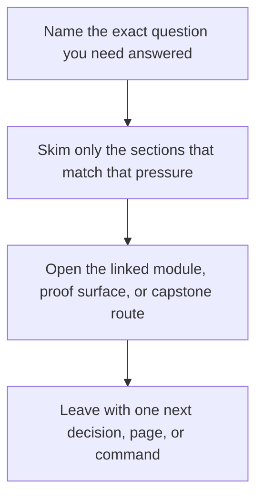

# Capstone File Guide

<!-- page-maps:start -->
## Guide Fit

<!-- page-maps:end -->

Read the first diagram as a timing map: this guide is for a named pressure, not for wandering the whole course-book. Read the second diagram as the guide loop: arrive with a concrete question, use only the matching sections, then leave with one smaller and more honest next move.

This page explains which capstone files matter first and what responsibility each one
holds.

Use it when the repository feels understandable at a directory level but not yet at a
file level.

---

## Start With These Files

| File | Why it matters |
| --- | --- |
| [Capstone Guide](index.md) | defines the repository contract and the teaching route through the workflow |
| `capstone/Snakefile` | shows the orchestration entrypoint and how rule families are assembled |
| `capstone/workflow/rules/common.smk` | establishes shared functions, path logic, and workflow-wide conventions |
| `capstone/workflow/rules/preprocess.smk` | contains discovery and per-sample processing contracts |
| `capstone/workflow/rules/publish.smk` | defines the stable publish boundary and integrity evidence |
| [Publish Review Guide](publish-review-guide.md) | documents which files are public contracts and which remain internal |
| `capstone/Makefile` | exposes the learner-facing proof and verification commands |
| [Capstone Walkthrough](capstone-walkthrough.md) | explains the repository as a guided review surface rather than only a runnable workflow |

[Back to top](#top)

---

## Directory Responsibilities

| Path | Responsibility |
| --- | --- |
| `capstone/data/raw/` | committed toy inputs that begin the discovery story |
| `capstone/data/reference/` and `capstone/data/panel/` | small reference assets used by the screening rules |
| `capstone/config/` | workflow configuration and schema validation surfaces |
| `capstone/workflow/rules/` | Snakemake rule families and orchestration boundaries |
| `capstone/workflow/modules/` | modular rule bundles used to keep repository growth legible |
| `capstone/workflow/scripts/` | helper scripts that belong beside workflow orchestration rather than the Python package |
| `capstone/src/capstone/` | reusable Python implementation for data-processing steps |
| `capstone/profiles/` | operating-context policy for local, CI, and SLURM execution |
| `capstone/tests/` | unit and workflow-level checks that defend repository truth |

[Back to top](#top)

---

## Best Reading Order

1. [Capstone Guide](index.md)
2. `capstone/Snakefile`
3. `capstone/workflow/rules/common.smk`
4. `capstone/workflow/rules/preprocess.smk`
5. `capstone/workflow/rules/summarize_report.smk`
6. `capstone/workflow/rules/publish.smk`
7. [Publish Review Guide](publish-review-guide.md)
8. `capstone/Makefile`
9. `capstone/profiles/`
10. `capstone/tests/`

That order keeps the learner anchored in contract first, workflow meaning second,
operational proof third, and published evidence last.

[Back to top](#top)

---

## Common Wrong Reading Order

Avoid starting with:

* helper Python files before reading the workflow contract
* published artifacts before understanding how discovery and preprocessing work
* profile files before you know which workflow behavior must remain stable
* tests before you know what the repository is promising to downstream users

That route teaches fragments without the boundary story that makes them useful.

[Back to top](#top)
