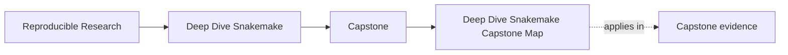
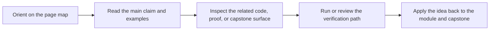

# Deep Dive Snakemake Capstone Map

<!-- page-maps:start -->
## Page Maps

<!-- page-maps:end -->

Read the first diagram as a timing map: the capstone is a corroboration surface, not the
first lesson. Read the second diagram as the route rule: choose one capstone route by
module or question, inspect the matching surface, then stop when one honest proof route
is visible.

## Enter the capstone at the right time

Enter only when the module idea is already legible in the local exercise.

Return to the module first if:

- you cannot yet explain the concept on a smaller workflow
- you do not know which command should prove the behavior
- the repository feels larger than the concept you are studying

## Choose the route by question

| If the question is... | Start here | Escalate only if needed |
| --- | --- | --- |
| what this repository promises | [Capstone Guide](index.md) | [Capstone Walkthrough](capstone-walkthrough.md) |
| which repository surface matches the current module | the table below | [Capstone File Guide](capstone-file-guide.md) |
| which command should prove the current claim | [Command Guide](command-guide.md) | [Capstone Proof Guide](capstone-proof-guide.md) |
| what is safe for downstream trust | [Capstone Review Worksheet](capstone-review-worksheet.md) | `make PROGRAM=reproducible-research/deep-dive-snakemake capstone-verify-report` |
| what differs across execution contexts | [Capstone Architecture Guide](capstone-architecture-guide.md) | [Capstone Review Worksheet](capstone-review-worksheet.md) |

## Choose the route by module arc

| Module arc | What should already be clear locally | First capstone route |
| --- | --- | --- |
| Modules 01-02 | truthful file contracts, deterministic discovery, and explicit checkpoints | [Capstone Walkthrough](capstone-walkthrough.md) |
| Modules 03-04 | policy surfaces, execution boundaries, and repository interfaces | [Command Guide](command-guide.md) |
| Modules 05-08 | software boundaries, publish contracts, and operating contexts | [Capstone Proof Guide](capstone-proof-guide.md) |
| Modules 09-10 | incident evidence, migration boundaries, and stewardship judgment | [Capstone Review Worksheet](capstone-review-worksheet.md) |

## Module-to-capstone map

| Module | Main question | Capstone surface | First command |
| --- | --- | --- | --- |
| 01 File Contracts | what makes the workflow file-driven instead of script-shaped | `Snakefile`, `workflow/rules/common.smk`, `publish/v1/` | `make walkthrough` |
| 02 Dynamic DAGs | where discovery becomes explicit instead of magical | checkpoint rule files, discovered-set artifacts, `publish/v1/discovered_samples.json` | `make verify` |
| 03 Production Operation | what counts as workflow semantics versus operating policy | `profiles/`, `Makefile`, `tests/selftest.sh` | `make profile-audit` |
| 04 Scaling Patterns | how repository structure stays legible as the workflow grows | `workflow/rules/`, `workflow/modules/`, `FILE_API.md`, `TOUR.md` | `make tour` |
| 05 Rule Boundaries | where rule ownership ends and software, runtime, and provenance surfaces begin | `workflow/scripts/provenance.py`, `workflow/envs/python.yaml`, `src/capstone/`, `environment.yaml`, `Dockerfile` | `make proof` |
| 06 Publish Contracts | what downstream consumers may trust from the workflow and how that bundle is defended | `publish/v1/`, `workflow/rules/summarize_report.smk`, `workflow/rules/publish.smk`, `workflow/contracts/FILE_API.md`, `scripts/verify_publish.py` | `make verify-report` |
| 07 Workflow Architecture | how repository layers, helper code, and file APIs are split deliberately | `Snakefile`, `workflow/rules/`, `workflow/modules/`, `workflow/contracts/FILE_API.md`, `workflow/CONTRACT.md`, `src/capstone/` | `make proof` |
| 08 Operating Contexts | how local, CI, and scheduler policy differ without semantic drift and how those differences are audited | `profiles/local/`, `profiles/ci/`, `profiles/slurm/`, `Makefile`, `scripts/profile_summary.py`, `capstone/docs/profile-audit-guide.md` | `make profile-audit` |
| 09 Incident Response | how logs, benchmarks, and workflow-tour evidence support diagnosis | `logs/`, `benchmarks/`, incident bundle surfaces | `make proof` |
| 10 Governance | whether another maintainer could review or migrate the workflow safely | `Snakefile`, `FILE_API.md`, `profiles/`, `tests/`, `Makefile` | `make confirm` |

## Good stopping point

Stop when you can name one capstone surface, one command, and one reason they are
enough for the current module or question. If you still feel pulled toward the whole
repository, step back to the smaller route.
