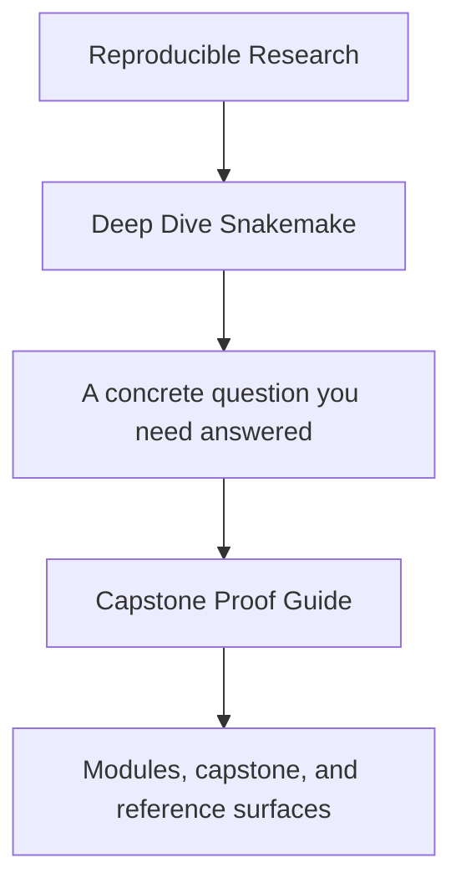
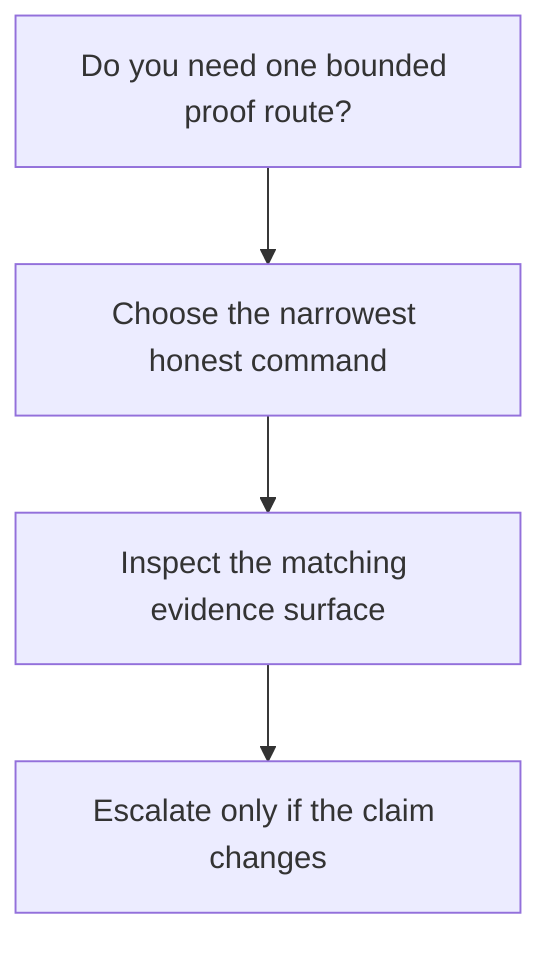

# Capstone Proof Guide

<!-- page-maps:start -->
## Guide Fit

<!-- page-maps:end -->

Read the first diagram as a timing map: this guide is for one bounded proof route, not
for whole-repository study. Read the second diagram as the rule: choose the narrowest
honest command, inspect the matching evidence, then escalate only if the claim changes.

Use this page when a module makes a Snakemake design claim and you want the shortest
honest route to the capstone evidence that supports it.

## Enter this guide at the right time

Use this guide once the module idea is already legible in its local exercise.

Before that point, prefer [Capstone Walkthrough](capstone-walkthrough.md) so the
repository stays smaller than the concept you are learning.

## Start by proof need

| If you need to prove... | Start here | Escalate only if needed |
| --- | --- | --- |
| repository shape without execution | `make PROGRAM=reproducible-research/deep-dive-snakemake capstone-walkthrough` | `capstone-tour` |
| executed workflow behavior | `make PROGRAM=reproducible-research/deep-dive-snakemake capstone-tour` | `proof` |
| publish-boundary trust | `make PROGRAM=reproducible-research/deep-dive-snakemake capstone-verify-report` | `capstone-confirm` |
| execution-policy differences | [Capstone Architecture Guide](capstone-architecture-guide.md) | `proof` |
| steward-level confidence | `make PROGRAM=reproducible-research/deep-dive-snakemake proof` | `capstone-confirm` |

## Bounded proof pass

1. Read [Capstone Guide](index.md).
2. Use [Proof Matrix](../guides/proof-matrix.md) to choose the narrowest command.
3. Run that command from the capstone or course root.
4. Record what the evidence proves before opening a stronger route.

## Good stopping point

Stop when you can say:

- which command gave the narrowest honest answer
- which evidence surface actually settled the claim
- why a broader route would be unnecessary unless the claim changed

If you cannot say those three things, repeat the bounded route before escalating.
