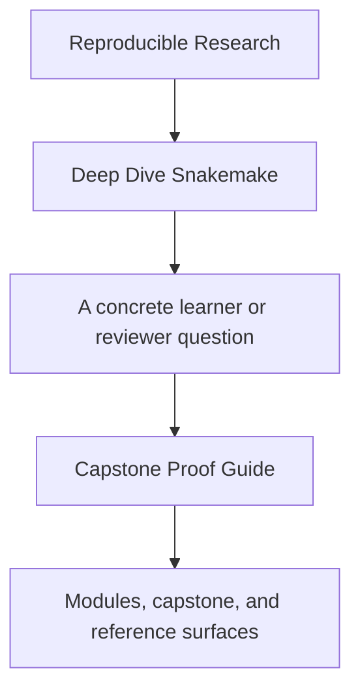
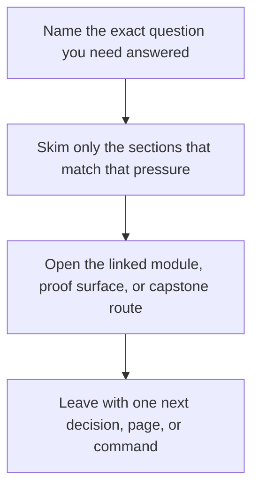

# Capstone Proof Guide

<!-- page-maps:start -->
## Guide Fit

<!-- page-maps:end -->

Read the first diagram as a timing map: this guide is for a named pressure, not for wandering the whole course-book. Read the second diagram as the guide loop: arrive with a concrete question, use only the matching sections, then leave with one smaller and more honest next move.

Use this page when a module makes a Snakemake design claim and you want the shortest
honest route to the capstone evidence that supports it.

---

## Enter This Guide At The Right Time

Use this guide once the module idea is already legible in its local exercise.

Before that point, prefer `make PROGRAM=reproducible-research/deep-dive-snakemake capstone-walkthrough`
so the repository stays smaller than the concept you are learning.

For Modules 05 to 10, this guide becomes the default route into the larger proof,
publish, policy, and confirmation commands.

---

## Recommended Route

1. Read `capstone/PROOF_GUIDE.md`.
2. Use [Proof Matrix](../guides/proof-matrix.md) to choose the narrowest command.
3. Run that command from the capstone or course root.
4. Use [Capstone Review Worksheet](capstone-review-worksheet.md) to record what the evidence actually proves.

[Back to top](#top)

---

## Strongest Default Routes

- `make PROGRAM=reproducible-research/deep-dive-snakemake capstone-walkthrough` when you want first-contact evidence without execution
- `make PROGRAM=reproducible-research/deep-dive-snakemake capstone-tour` when you want executed workflow proof
- `make PROGRAM=reproducible-research/deep-dive-snakemake capstone-verify-report` when you want publish-boundary review
- `make PROGRAM=reproducible-research/deep-dive-snakemake capstone-profile-audit` when you want execution-policy review
- `make PROGRAM=reproducible-research/deep-dive-snakemake proof` when you want the sanctioned learner-facing route
- `make PROGRAM=reproducible-research/deep-dive-snakemake capstone-confirm` when you want clean-room contract confirmation

[Back to top](#top)

---

## What A Good Proof Review Can Answer

- which command gives the narrowest honest answer to the question you have
- which files are proving workflow meaning versus publish trust versus operating policy
- when a broader route is necessary because the narrower route is no longer enough

[Back to top](#top)
