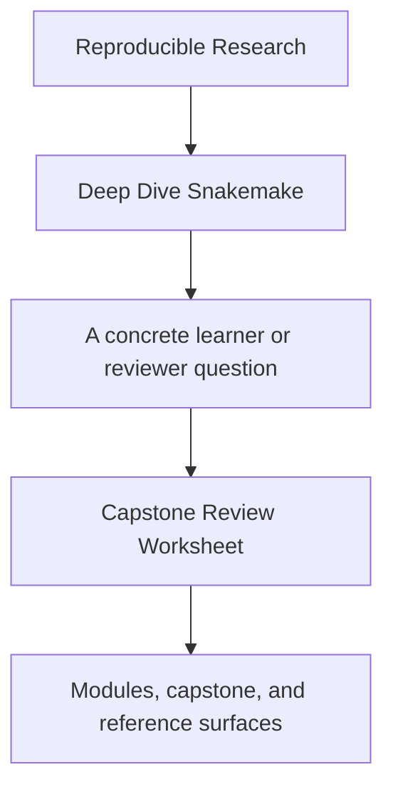
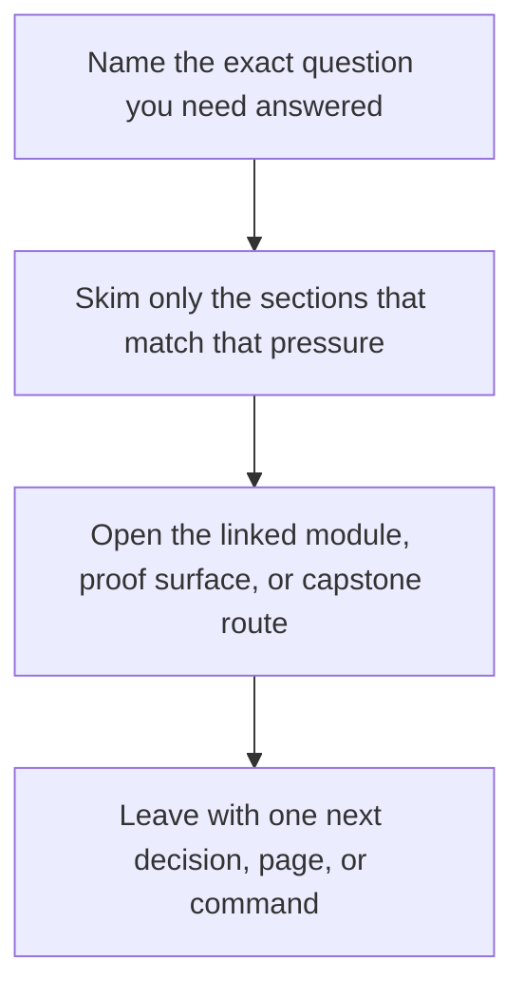

# Capstone Review Worksheet

<!-- page-maps:start -->
## Guide Fit

<!-- page-maps:end -->

Read the first diagram as a timing map: this guide is for a named pressure, not for wandering the whole course-book. Read the second diagram as the guide loop: arrive with a concrete question, use only the matching sections, then leave with one smaller and more honest next move.

Use this worksheet when reviewing the Snakemake capstone as a workflow repository, not
only as a lesson artifact.

The point is to make review concrete enough that another maintainer could compare your
judgment with the same evidence.

---

## Repository Contract

Answer these first:

1. What is the repository claiming to build and publish?
2. Which surfaces are public contracts and which are internal execution detail?
3. Which files define the publish boundary?

[Back to top](#top)

---

## Workflow Truth

Review these surfaces together:

* `capstone/Snakefile`
* `capstone/workflow/rules/`
* the discovered-set artifact and related checkpoint evidence

Write down:

1. which rules define meaningful file contracts
2. where dynamic discovery becomes explicit and durable
3. whether any behavior still feels hidden or nondeterministic

[Back to top](#top)

---

## Policy And Operating Context

Review these surfaces together:

* `capstone/profiles/`
* `capstone/Makefile`
* the dry-run and workflow-tour bundles

Write down:

1. which settings are operating policy rather than workflow meaning
2. what would change between local, CI, and scheduler contexts
3. whether any policy surface leaks into semantics

[Back to top](#top)

---

## Publish Boundary

Review these surfaces together:

* `capstone/docs/FILE_API.md`
* `capstone/publish/v1/`
* `capstone/publish/v1/manifest.json`

Write down:

1. which outputs are safe for downstream trust
2. which artifacts remain internal repository state
3. whether the promoted contract is smaller and clearer than the whole repository

[Back to top](#top)

---

## Final Review Questions

Finish with these:

* what is the repository's strongest design choice
* what is the most fragile boundary
* what would you inspect first before approving a migration
* what would you refuse to change without new evidence

[Back to top](#top)
