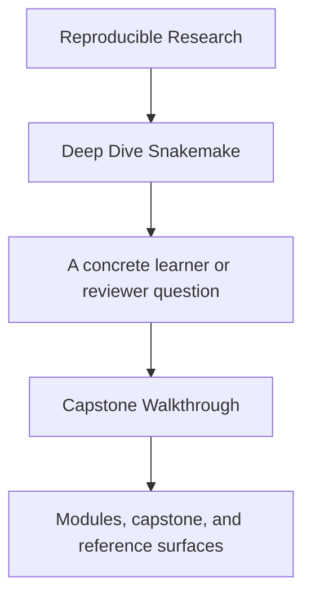
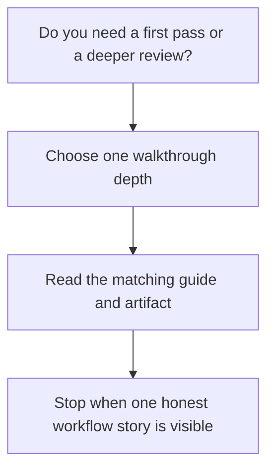

# Capstone Walkthrough

<!-- page-maps:start -->
## Guide Fit

<!-- page-maps:end -->

Read the first diagram as a timing map: this page gives the capstone a teaching route,
not just a repository map. Read the second diagram as the rule: choose one walkthrough
depth, read the matching guide and artifact, then stop when one honest workflow story is
visible.

## First pass versus deeper pass

- First pass: use the learner-first route when you need one bounded workflow story from file contract to executed proof.
- Deeper pass: use the longer routes only when the question changes from entry to policy, publish, or stewardship review.

## 30-minute first pass

1. Read [Capstone Guide](index.md).
2. Run `make PROGRAM=reproducible-research/deep-dive-snakemake capstone-walkthrough`.
3. Read the copied `Snakefile`, rule files, `list-rules.txt`, and `dryrun.txt` in that order.
4. Read [Capstone File Guide](capstone-file-guide.md).
5. Use [Capstone Review Worksheet](capstone-review-worksheet.md) to record what is visible before execution.

Goal: leave with a clear picture of what the workflow claims to build, where dynamic
discovery is declared, and which files are public contracts.

## Executed workflow pass

Use this only after the first pass is clear.

1. Run `make PROGRAM=reproducible-research/deep-dive-snakemake capstone-tour`.
2. Read the executed proof bundle.
3. Compare the bundle's publish artifacts against `FILE_API.md`.
4. Follow one rule family back into `workflow/rules/`.

Goal: see how the planned workflow becomes executed evidence without losing contract
clarity.

## Good stopping point

Stop when you can explain one complete workflow story:

- the public contract you started from
- the rule or artifact that makes the contract visible
- the next command that would strengthen the claim only if needed

If you cannot tell that story yet, do not widen the walkthrough. Repeat the smaller
pass.
