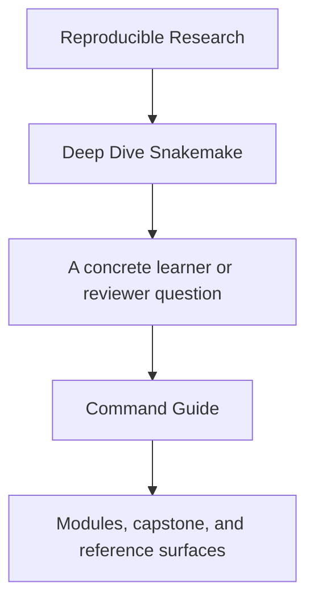
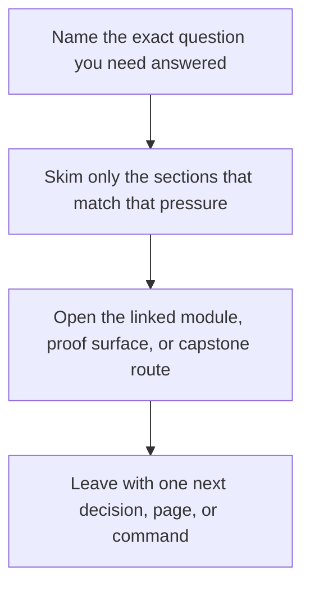

# Command Guide

<!-- page-maps:start -->
## Guide Fit

<!-- page-maps:end -->

Read the first diagram as a timing map: this guide is for a named pressure, not for wandering the whole course-book. Read the second diagram as the guide loop: arrive with a concrete question, use only the matching sections, then leave with one smaller and more honest next move.

Deep Dive Snakemake has three command layers: repository root, program directory, and
capstone directory. This page makes those boundaries explicit.

Use it when you know what proof question you have but are not sure where the command
belongs.

---

## Repository Root

Use root-level commands when you want one entrypoint that works across programs.

| Command | What it does |
| --- | --- |
| `make PROGRAM=reproducible-research/deep-dive-snakemake program-help` | show the program Makefile surface |
| `make PROGRAM=reproducible-research/deep-dive-snakemake docs-build` | build the course docs in strict mode |
| `make PROGRAM=reproducible-research/deep-dive-snakemake capstone-walkthrough` | build the learner-first capstone walkthrough bundle |
| `make PROGRAM=reproducible-research/deep-dive-snakemake capstone-tour` | build the executed capstone proof bundle |
| `make PROGRAM=reproducible-research/deep-dive-snakemake proof` | run the sanctioned learner-facing proof route |
| `make PROGRAM=reproducible-research/deep-dive-snakemake capstone-verify-report` | build the publish verification report bundle |
| `make PROGRAM=reproducible-research/deep-dive-snakemake capstone-profile-audit` | package execution-policy review evidence |
| `make PROGRAM=reproducible-research/deep-dive-snakemake capstone-selftest` | run the determinism self-test route |
| `make PROGRAM=reproducible-research/deep-dive-snakemake test` | run the course's main verification target |

[Back to top](#top)

---

## Program Directory

Use `programs/reproducible-research/deep-dive-snakemake/` when you want the course-local
surface.

| Command | What it does |
| --- | --- |
| `make help` | show program-level targets |
| `make test` | run the capstone fast verification suite via the program surface |
| `make capstone-walkthrough` | build the learner-first walkthrough bundle |
| `make capstone-tour` | build the executed capstone proof bundle |
| `make proof` | run the sanctioned learner-facing proof route |
| `make capstone-profile-audit` | package execution-policy review evidence |
| `make clean` | remove program and capstone build artifacts |

[Back to top](#top)

---

## Capstone Directory

Use `capstone/` when you want the raw executable workflow repository.

| Command | What it does |
| --- | --- |
| `make help` | show public capstone targets |
| `make bootstrap` | create the supported local toolchain and print the resolved versions |
| `make bootstrap-confirm` | create the supported local toolchain and run the strongest clean-room confirmation route |
| `make walkthrough` | build the learner-first reading bundle without executing the workflow |
| `make wf-dryrun` | preview the execution plan with printed commands |
| `make verify` | execute the workflow and validate the promoted contract |
| `make confirm` | run formatting, tests, workflow checks, execution, and artifact validation |
| `make tour` | build the executed proof bundle |
| `make proof` | run the sanctioned learner-facing proof route |
| `make profile-audit` | compare local, CI, and scheduler policy bundles |

[Back to top](#top)

---

## Best Defaults by Module Arc

| Module arc | Start here | Then use |
| --- | --- | --- |
| Fresh machine setup | `make -C capstone bootstrap-confirm` | `make -C capstone proof` |
| Modules 01-02 | `make PROGRAM=reproducible-research/deep-dive-snakemake capstone-walkthrough` | `make PROGRAM=reproducible-research/deep-dive-snakemake test` |
| Modules 03-04 | `make PROGRAM=reproducible-research/deep-dive-snakemake capstone-tour` | `make PROGRAM=reproducible-research/deep-dive-snakemake capstone-verify-report` |
| Modules 05-09 | `make PROGRAM=reproducible-research/deep-dive-snakemake proof` | `make PROGRAM=reproducible-research/deep-dive-snakemake capstone-profile-audit` |
| Module 10 | `make PROGRAM=reproducible-research/deep-dive-snakemake capstone-confirm` | `make -C capstone info` |

[Back to top](#top)
