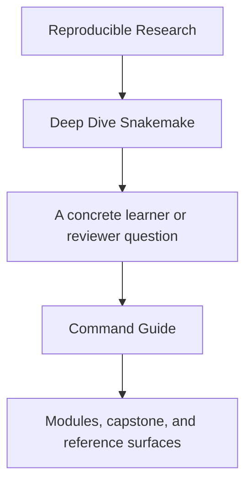
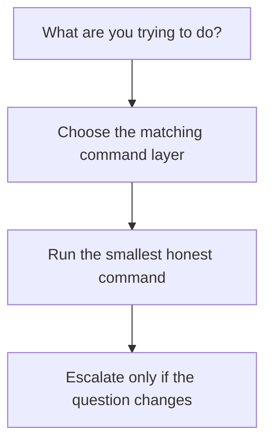

# Command Guide

<!-- page-maps:start -->
## Guide Fit

<!-- page-maps:end -->

Read the first diagram as a timing map: this page is for command choice, not for reading
the whole capstone. Read the second diagram as the rule: choose the command layer that
matches the current job, run the smallest honest command, then escalate only if the
question changes.

Deep Dive Snakemake has three command layers: repository root, program directory, and
capstone directory. The layers exist so learners do not have to guess where a command
belongs.

## Choose the command layer

| If you need... | Use this layer | Why |
| --- | --- | --- |
| one stable entrypoint from the repository root | repository root | consistent commands across all programs |
| course-local commands while staying inside the program | `programs/reproducible-research/deep-dive-snakemake/` | a smaller surface than the repo root |
| the raw executable workflow repository | `capstone/` | direct access to the workflow itself |

## Start by job, not by directory

| If the job is... | Start here | Do not start with |
| --- | --- | --- |
| first-pass capstone reading | `make PROGRAM=reproducible-research/deep-dive-snakemake capstone-walkthrough` | `make -C capstone confirm` |
| executed workflow review | `make PROGRAM=reproducible-research/deep-dive-snakemake capstone-tour` | `make -C capstone proof` |
| publish-boundary verification | `make PROGRAM=reproducible-research/deep-dive-snakemake capstone-verify-report` | `make -C capstone confirm` |
| execution-policy comparison | `make PROGRAM=reproducible-research/deep-dive-snakemake capstone-profile-audit` | random `make -C capstone` exploration |
| strongest final confirmation | `make PROGRAM=reproducible-research/deep-dive-snakemake capstone-confirm` | `make PROGRAM=reproducible-research/deep-dive-snakemake capstone-walkthrough` |

## Repository root

Use root-level commands when you want one entrypoint that works across programs.

- `make PROGRAM=reproducible-research/deep-dive-snakemake capstone-walkthrough`
- `make PROGRAM=reproducible-research/deep-dive-snakemake capstone-tour`
- `make PROGRAM=reproducible-research/deep-dive-snakemake proof`
- `make PROGRAM=reproducible-research/deep-dive-snakemake capstone-verify-report`
- `make PROGRAM=reproducible-research/deep-dive-snakemake capstone-confirm`

## Program directory

Use `programs/reproducible-research/deep-dive-snakemake/` when you want the course-local
surface.

- `make capstone-walkthrough`
- `make capstone-tour`
- `make proof`
- `make capstone-profile-audit`
- `make capstone-confirm`

## Capstone directory

Use `capstone/` when you want the raw reference workflow.

- `make walkthrough`
- `make verify`
- `make tour`
- `make verify-report`
- `make profile-audit`
- `make confirm`

## Good stopping point

Stop when you can explain why the chosen command layer is proportionate to the current
question. If the layer still feels too large, step down one layer before opening more
targets.
