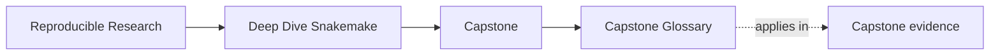
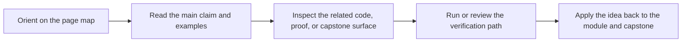

# Capstone Glossary

<!-- page-maps:start -->
## Page Maps

<!-- page-maps:end -->

Use this page when the Snakemake capstone routes start sounding interchangeable. The
goal is to keep workflow meaning, operating policy, and publish trust separate.

| Term | Meaning here |
| --- | --- |
| walkthrough | the bounded first pass through the workflow repository before stronger executed proof |
| rule contract | the explicit input, output, and log relationship a rule is allowed to promise |
| discovery evidence | the durable artifact that records what dynamic discovery found instead of leaving it implicit |
| operating policy | executor, resource, and environment settings that change how the workflow runs without redefining its meaning |
| semantic drift | a change that alters workflow meaning rather than only execution policy |
| publish boundary | the downstream-facing output surface another person is allowed to trust |
| saved evidence bundle | an exported artifact set that lets a reviewer inspect the workflow later |
| stewardship review | the stronger route used when a maintainer must judge the whole repository, not only one run |
