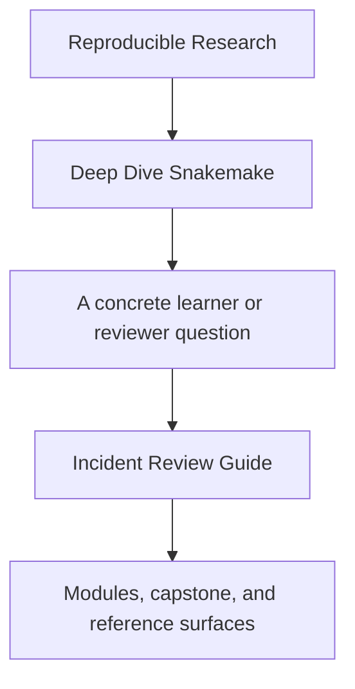
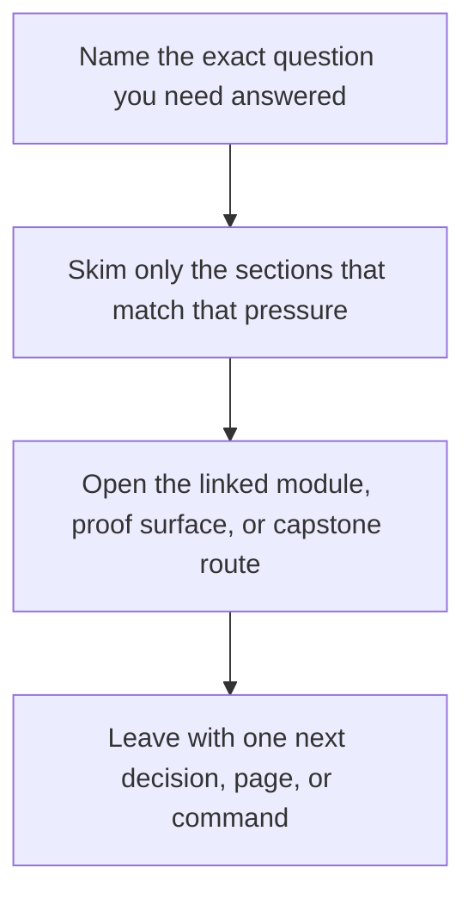

# Incident Review Guide

<!-- page-maps:start -->
## Guide Fit

<!-- page-maps:end -->

Read the first diagram as a timing map: this guide is for a named pressure, not for wandering the whole course-book. Read the second diagram as the guide loop: arrive with a concrete question, use only the matching sections, then leave with one smaller and more honest next move.

Use this page when the question is about incident response, reproducibility under
pressure, or workflow debugging with evidence instead of intuition.

---

## Recommended Route

1. Read `capstone/INCIDENT_REVIEW_GUIDE.md`.
2. Use [Proof Matrix](../guides/proof-matrix.md) to choose the narrowest command for the current symptom.
3. Compare the result with [Profile Audit Guide](profile-audit-guide.md) and [Publish Review Guide](publish-review-guide.md) if the problem spans multiple boundaries.

[Back to top](#top)

---

## What A Good Incident Review Can Answer

- whether the failure is about workflow semantics, execution policy, or downstream trust
- which command gives the most honest first evidence
- which files should remain unchanged until stronger proof exists

[Back to top](#top)
