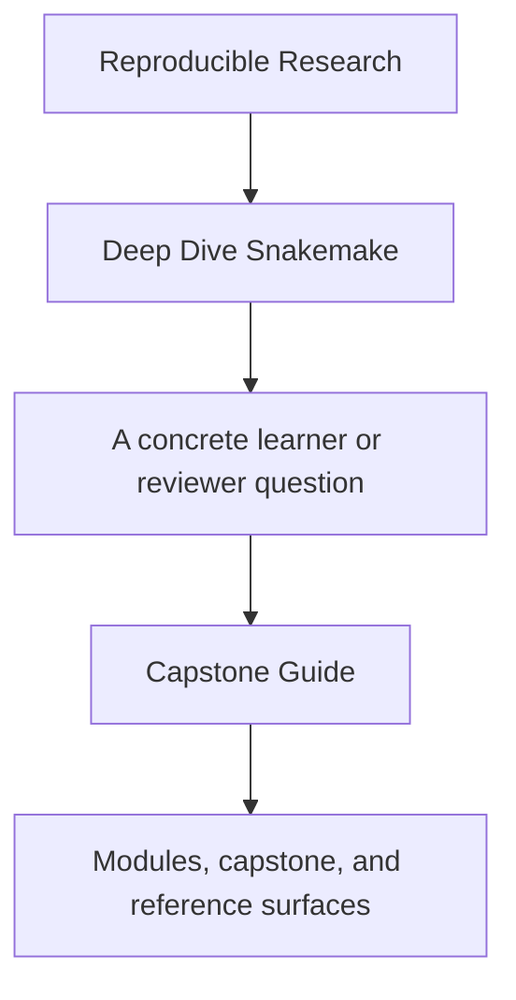
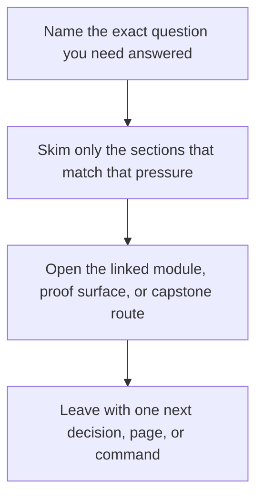

# Capstone Guide


<!-- page-maps:start -->
## Guide Fit




<!-- page-maps:end -->

Read the first diagram as a timing map: this guide is for a named pressure, not for wandering the whole course-book. Read the second diagram as the guide loop: arrive with a concrete question, use only the matching sections, then leave with one smaller and more honest next move.

The Snakemake capstone is the course’s executable proof. It is the place where the
course’s strongest claims become runnable:

- explicit file contracts instead of hidden edges
- dynamic discovery that leaves durable evidence
- profiles as policy instead of tribal command lines
- verification gates that make “it ran once” an unacceptable standard

## How to use it while reading

- After Module 01, inspect the rule contracts and the stable publish boundary.
- After Module 02, inspect the checkpoint and the way discovery becomes explicit output.
- After Module 03, inspect profiles, retries, and verification gates.
- After Module 04, inspect module boundaries, file APIs, and CI-style proof surfaces.

## Best entrypoints

- Repository guide: [`capstone/README.md`](https://github.com/bijux/bijux-masterclass/blob/master/programs/reproducible-research/deep-dive-snakemake/capstone/README.md)
- Publish contract: [`capstone/FILE_API.md`](https://github.com/bijux/bijux-masterclass/blob/master/programs/reproducible-research/deep-dive-snakemake/capstone/FILE_API.md)
- Workflow root: [`capstone/Snakefile`](https://github.com/bijux/bijux-masterclass/blob/master/programs/reproducible-research/deep-dive-snakemake/capstone/Snakefile)

## Core commands

```bash
make -C capstone walkthrough
make -C capstone wf-dryrun
make -C capstone verify
make -C capstone confirm
make -C capstone tour
```

## Study questions

- Which outputs are for internal workflow coordination and which are part of the public interface?
- What exactly does the checkpoint discover, and what does it never hide?
- Which proof artifacts would you inspect before trusting a run?
- Where would you extend the workflow without weakening the publish contract?
