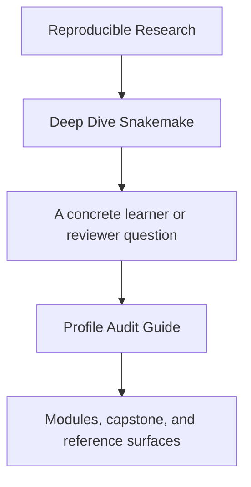
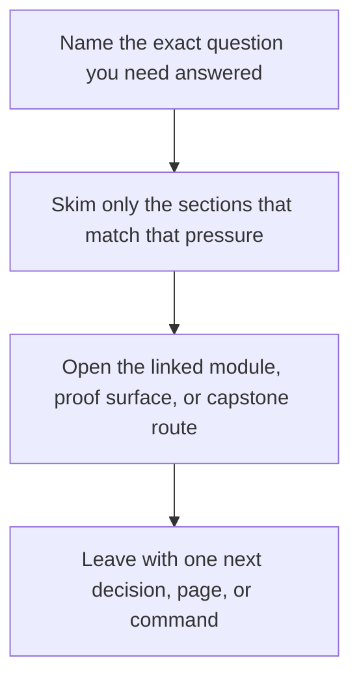

# Profile Audit Guide

<!-- page-maps:start -->
## Guide Fit

<!-- page-maps:end -->

Read the first diagram as a timing map: this guide is for a named pressure, not for wandering the whole course-book. Read the second diagram as the guide loop: arrive with a concrete question, use only the matching sections, then leave with one smaller and more honest next move.

Use this page when the question is about local, CI, and scheduler execution contexts
rather than about rule contracts alone.

---

## Recommended Route

1. Read the architecture review route in [Capstone File Guide](capstone-file-guide.md).
2. Run `make PROGRAM=reproducible-research/deep-dive-snakemake capstone-profile-audit`.
3. Compare the resulting bundle with [Capstone Review Worksheet](capstone-review-worksheet.md) and [Boundary Map](../reference/boundary-map.md).

---

## What A Good Audit Can Answer

- which settings are operating policy and which would change workflow meaning
- which context shift would be safest or riskiest for reproducibility
- where a reviewer should look first when execution context changes

