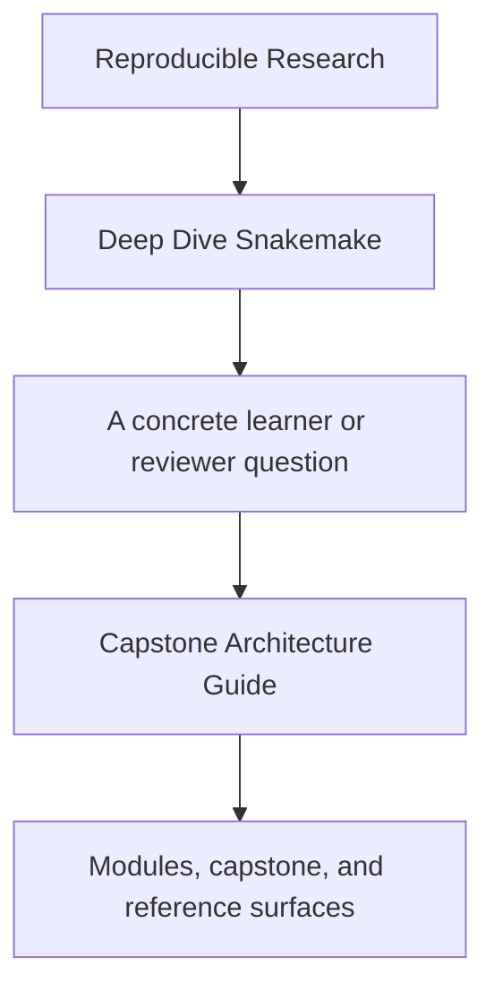
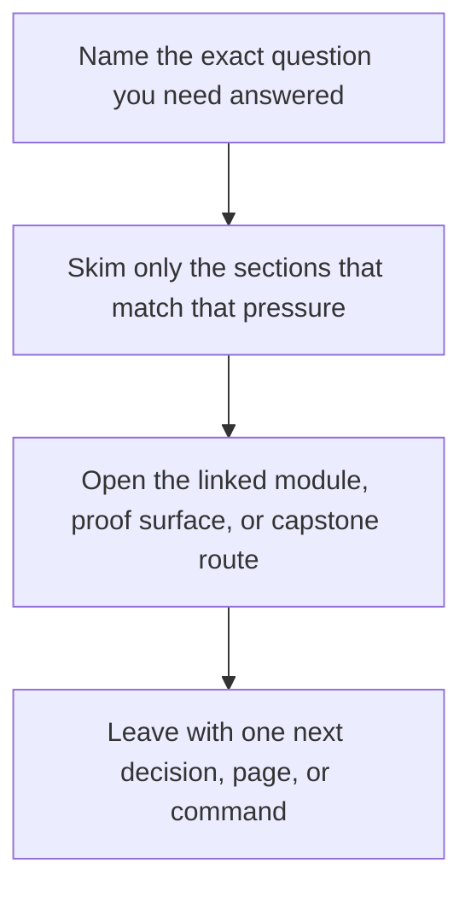

# Capstone Architecture Guide

<!-- page-maps:start -->
## Guide Fit

<!-- page-maps:end -->

Read the first diagram as a timing map: this guide is for a named pressure, not for wandering the whole course-book. Read the second diagram as the guide loop: arrive with a concrete question, use only the matching sections, then leave with one smaller and more honest next move.

Use this page when a module asks you to review the capstone as a repository architecture,
not only as a runnable workflow.

---

## Recommended Route

1. Read `capstone/ARCHITECTURE.md`.
2. Compare it with [Repository Layer Guide](../reference/repository-layer-guide.md) and [Capstone File Guide](capstone-file-guide.md).
3. Inspect the matching capstone files in the order the architecture guide names them.
4. Use [Proof Matrix](proof-matrix.md) to pick the strongest command for the boundary you are reviewing.

[Back to top](#top)

---

## What The Architecture Should Prove

- workflow meaning is still visible in `Snakefile` and `workflow/rules/`
- helper code has not swallowed the visible rule graph
- profiles and config stay operational rather than analytical
- the publish boundary remains smaller and clearer than the full repository state

[Back to top](#top)

---

## Best Moments To Use It

- after Module 04, when repository growth and interface boundaries become central
- after Module 07, when the full repository architecture becomes part of the lesson
- after Module 10, when reviewing the capstone as a long-lived workflow product

[Back to top](#top)
