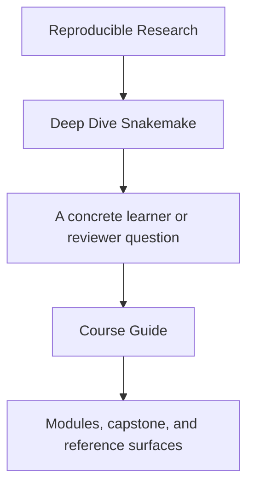
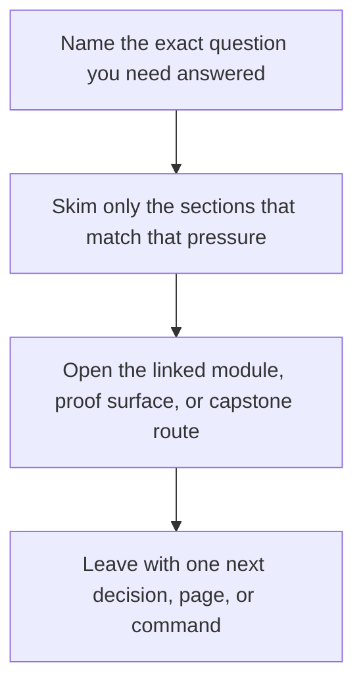

<a id="top"></a>

# Course Guide


<!-- page-maps:start -->
## Guide Fit




<!-- page-maps:end -->

Read the first diagram as a timing map: this guide is for a named pressure, not for wandering the whole course-book. Read the second diagram as the guide loop: arrive with a concrete question, use only the matching sections, then leave with one smaller and more honest next move.

Deep Dive Snakemake now has enough support material that learners need one stable hub for
finding the right page quickly. The goal is not to memorize Snakemake features. The goal
is to learn how explicit file contracts, dynamic safety, and durable workflow evidence
fit together over a ten-module sequence.

## Course Spine

The course has four linked layers:

1. entry pages and orientation
2. module work from file contracts to tool-boundary judgment
3. capstone proof in one executable workflow repository
4. review surfaces for publish, profile, and incident questions

## The Four Arcs

### File-contract foundations

Modules 01 to 02 establish the semantic floor:

- why workflows must declare file contracts before they scale
- how dynamic DAG behavior stays deterministic and reviewable
- how discovery can remain explicit instead of magical

### Policy and scaling boundaries

Modules 03 to 05 turn the workflow into something survivable:

- profiles, retries, and execution policy become reviewable boundaries
- scaling patterns stop hiding coupling behind convenience
- software boundaries make helper code, environments, and wrappers honest

### Publish and architecture surfaces

Modules 06 to 08 move from workflow correctness to durable repository design:

- publish contracts define what downstream consumers may trust
- repository architecture and file APIs make the workflow legible under growth
- operating context separates workflow semantics from execution policy

### Incident and governance judgment

Modules 09 to 10 finish the course where long-lived workflows are judged:

- performance and incidents become observable and explainable
- migration and governance decisions stay tied to contracts instead of habit

## How The Capstone Fits

- Modules 01 to 02 explain the capstone's file contracts, checkpoints, and deterministic discovery.
- Modules 03 to 05 explain its profiles, wrappers, helper-code boundaries, and policy surfaces.
- Modules 06 to 08 explain its publish routes, file APIs, and operating-context boundaries.
- Modules 09 to 10 explain its incident review, migration judgment, and stewardship rules.

## Support Pages To Keep Open

- [Module Promise Map](module-promise-map.md) when you want the module titles translated into explicit learner contracts
- [Module Checkpoints](module-checkpoints.md) when you need a module-end exit bar
- [Workflow Modularization](workflow-modularization.md) when you need a decision tool for repository splits
- [Module Dependency Map](../reference/module-dependency-map.md) when the reading order needs justification
- [Boundary Map](../reference/boundary-map.md) when you need workflow versus policy separation
- [Proof Ladder](proof-ladder.md) and [Proof Matrix](proof-matrix.md) when you need to size or route proof correctly
- [Capstone Map](../capstone/capstone-map.md) when you want the repository route by module

## Honest Expectation

If you rush, the course will feel like a collection of workflow tricks. If you read it
in order and keep the capstone in view, the later modules should feel like consequences
of earlier file-contract and publish-boundary decisions rather than unrelated advanced
features.

## Best Three Entry Commands

```sh
make PROGRAM=reproducible-research/deep-dive-snakemake capstone-walkthrough
make PROGRAM=reproducible-research/deep-dive-snakemake capstone-tour
make PROGRAM=reproducible-research/deep-dive-snakemake test
```

[Back to top](#top)
