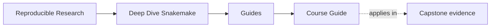
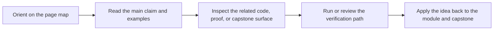

# Course Guide

<!-- page-maps:start -->
## Page Maps

<!-- page-maps:end -->

Read the first diagram as a timing map: this guide is a support hub, not another chapter.
Read the second diagram as the loop: identify the kind of help you need, choose the
matching surface, then leave with one smaller next move.

Deep Dive Snakemake has four durable surfaces:

1. course home and orientation for entry and reading order
2. modules for the teaching arc itself
3. capstone pages for executable corroboration
4. reference pages for durable review and repair maps

## Choose the right surface

| If you need... | Start here | Do not start with |
| --- | --- | --- |
| first entry into the course | [Start Here](start-here.md) | the capstone repository |
| the module sequence explained | [Module 00](../module-00-orientation/index.md) | incident or governance pages |
| one support page for urgency | [Pressure Routes](pressure-routes.md) | random browsing through `guides/` |
| workflow-versus-policy separation | [Topic Boundaries](../reference/topic-boundaries.md) | the strongest available command |
| module-to-repository routing | [Capstone Map](../capstone/capstone-map.md) | raw repository files |
| durable review maps | [Reference](../reference/index.md) | course-home prose |

## The teaching arc

| Arc | Modules | What becomes legible |
| --- | --- | --- |
| file-contract foundations | Modules 01-02 | truthful file contracts, deterministic discovery, and explicit checkpoints |
| policy and scaling boundaries | Modules 03-05 | profiles, scaling interfaces, helper-code boundaries, and honest software seams |
| publish and architecture surfaces | Modules 06-08 | downstream contracts, repository file APIs, and operating-context boundaries |
| incident and governance judgment | Modules 09-10 | observability, incident evidence, migration boundaries, and stewardship judgment |

## The support shelf by job

- Read [Boundary Review Prompts](../reference/boundary-review-prompts.md) when repository splits or module boundaries feel fuzzy.
- Read [Module Promise Map](module-promise-map.md) when module titles feel too compressed.
- Read [Module Checkpoints](module-checkpoints.md) when you need a visible exit bar.
- Read [Pressure Routes](pressure-routes.md) when the reading order is shaped by urgency.
- Read [Proof Matrix](proof-matrix.md) when you already know the claim and need the evidence surface.
- Read [Command Guide](../capstone/command-guide.md) when you know the route but not the command layer.
- Read [Capstone Guide](../capstone/index.md) when you need the capstone contract before opening repository files.

## Best defaults

Use these as your stable defaults unless the current pressure gives you a stronger reason:

1. enter with [Start Here](start-here.md)
2. anchor in [Module 00](../module-00-orientation/index.md)
3. read modules in order
4. keep [Proof Ladder](proof-ladder.md) nearby
5. enter the capstone through [Capstone Map](../capstone/capstone-map.md)

## Good stopping point

Stop when you can answer two questions clearly:

- which surface should answer the next question
- why the heavier surfaces would be premature right now
