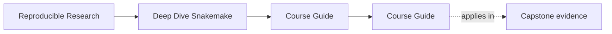
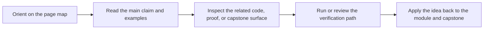

<a id="top"></a>

# Course Guide


<!-- page-maps:start -->
## Page Maps




<!-- page-maps:end -->

Deep Dive Snakemake now has enough support material that learners need one stable hub for
finding the right page quickly.

This guide groups the course surfaces by the question you are trying to answer.

---

## If You Are New Here

Start with these pages in order:

1. [`start-here.md`](start-here.md)
2. [`module-00-orientation/index.md`](../module-00-orientation/index.md)
3. [`learning-contract.md`](learning-contract.md)
4. [`module-dependency-map.md`](../reference/module-dependency-map.md)

Then begin Module 01.

[Back to top](#top)

---

## If You Need A Stable Reference

Use these pages when you already know the course but need a fast answer:

* [`workflow-glossary.md`](../reference/workflow-glossary.md) for shared vocabulary
* [`practice-map.md`](../reference/practice-map.md) for the right proof route
* [`capstone-file-guide.md`](capstone-file-guide.md) for file responsibilities
* [`capstone-map.md`](capstone-map.md) for module-to-repository routing

[Back to top](#top)

---

## If You Need The Capstone

Use these pages when the concept is already legible and you want the executable
repository:

* [`readme-capstone.md`](readme-capstone.md) for the repository contract
* [`capstone-map.md`](capstone-map.md) for the module route
* [`capstone-file-guide.md`](capstone-file-guide.md) for file responsibilities

Then use the capstone commands that match your question.

[Back to top](#top)

---

## If You Are Reviewing The Course

Use these pages when you care about maintainability, assessment, or stewardship:

* [`module-dependency-map.md`](../reference/module-dependency-map.md)
* [`learning-contract.md`](learning-contract.md)
* [`practice-map.md`](../reference/practice-map.md)
* [`readme-capstone.md`](readme-capstone.md)

[Back to top](#top)

---

## Best Three Entry Commands

```sh
make PROGRAM=reproducible-research/deep-dive-snakemake test
make PROGRAM=reproducible-research/deep-dive-snakemake capstone-walkthrough
make -C capstone help
```

[Back to top](#top)
