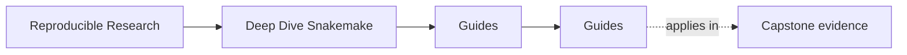
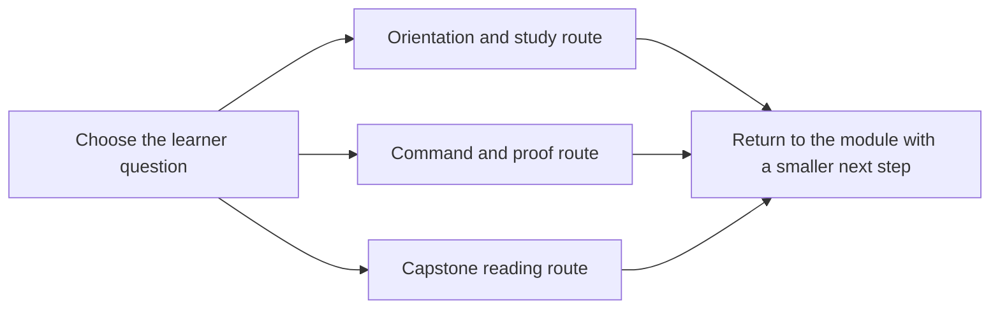

# Guides

<!-- page-maps:start -->
## Page Maps

<!-- page-maps:end -->

Use this page when you know you need support material but do not yet know which guide is
the right one.

The rule is simple: open the smallest page that answers the next honest learner question.

## Read These First

- [Start Here](start-here.md) for the shortest honest entry route
- [Course Guide](course-guide.md) for the full module arc and page roles
- [Learning Contract](learning-contract.md) for the teaching bar and proof expectations
- [Module 00: Orientation and Study Strategy](../module-00-orientation/index.md) for the course shape
- [Platform Setup](platform-setup.md) before you run local proof commands

## Use These For Study Planning

- [Pressure Routes](pressure-routes.md) when your route is shaped by repair, stewardship, or workflow pressure
- [Workflow Modularization](workflow-modularization.md) when the question is how far to split the workflow architecture
- [Module Promise Map](module-promise-map.md) when you want each module title translated into a learner contract
- [Module Checkpoints](module-checkpoints.md) when you want a module-end exit bar before moving on
- [Module Dependency Map](../reference/module-dependency-map.md) when you need the safe reading order explained
- [Practice Map](../reference/practice-map.md) when you want the module-to-proof loop in one place

## Use These For Commands And Proof

- [Command Guide](command-guide.md) for command boundaries
- [Proof Ladder](proof-ladder.md) for choosing the smallest honest proof route
- [Proof Matrix](proof-matrix.md) for routing a claim to the right evidence surface
- [Boundary Map](../reference/boundary-map.md) when you need workflow versus policy separation
- [Workflow Glossary](../reference/workflow-glossary.md) when the vocabulary itself is the blocker

## Use These For Capstone Reading

- [Capstone Guide](readme-capstone.md) for the repository contract
- [Capstone Architecture Guide](capstone-architecture-guide.md) for the repository structure
- [Capstone Map](capstone-map.md) for module-to-repository routing
- [Capstone File Guide](capstone-file-guide.md) for file responsibilities
- [Capstone Walkthrough](capstone-walkthrough.md) for a bounded first reading route
- [Capstone Proof Guide](capstone-proof-guide.md) for the shortest proof route
- [Publish Review Guide](publish-review-guide.md) for publish-boundary review
- [Profile Audit Guide](profile-audit-guide.md) for execution-policy review
- [Incident Review Guide](incident-review-guide.md) for workflow triage under pressure
- [Capstone Review Worksheet](capstone-review-worksheet.md) for structured repository assessment
- [Capstone Extension Guide](capstone-extension-guide.md) for safe evolution

## Keep The Layout Stable

- `index.md` stays the course home
- `guides/` stays the learner route and proof shelf
- `reference/` stays the durable workflow and review shelf
- `module-00-orientation/` plus Modules `01` to `10` stay the teaching arc
