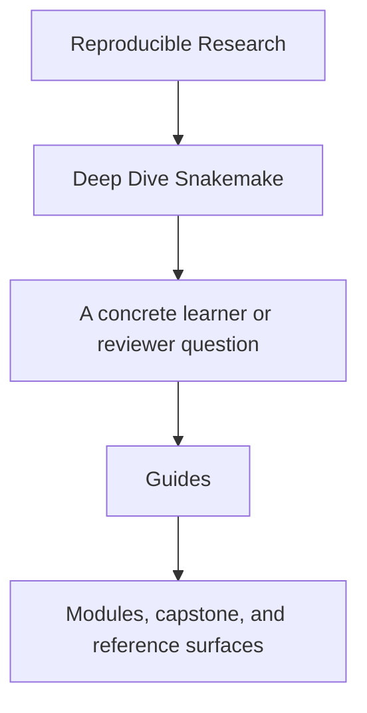
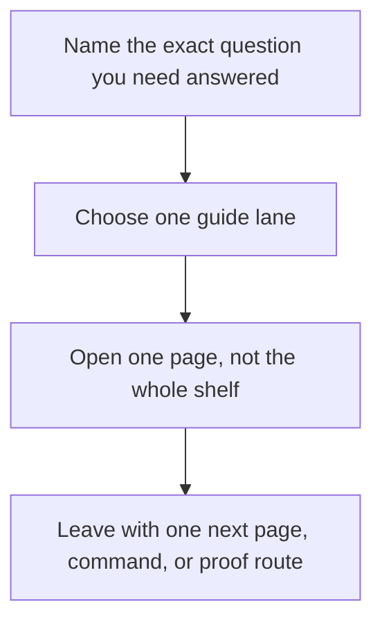

# Guides

<!-- page-maps:start -->
## Guide Fit

<!-- page-maps:end -->

Read the first diagram as a timing map: the guides shelf is for a named pressure, not
for wandering the whole course-book. Read the second diagram as the guide loop: choose
one lane, use one page, then leave with one smaller next move.

Use this shelf when you need route choice, proof sizing, or capstone entry help rather
than one module chapter.

## Choose one lane

| If you need... | Start here | Then use |
| --- | --- | --- |
| the shortest honest entry | [Start Here](start-here.md) | [Course Guide](course-guide.md) |
| the full support-page map | [Course Guide](course-guide.md) | [Learning Contract](learning-contract.md) |
| a route shaped by urgency | [Pressure Routes](pressure-routes.md) | [Proof Ladder](proof-ladder.md) |
| module promises and exit bars | [Module Promise Map](module-promise-map.md) | [Module Checkpoints](module-checkpoints.md) |
| workflow split decisions | [Topic Boundaries](../reference/topic-boundaries.md) | [Boundary Review Prompts](../reference/boundary-review-prompts.md) |
| capstone entry | [Capstone Guide](../capstone/index.md) | [Capstone Map](../capstone/capstone-map.md) |

## Use the shelf by job

| Job | Best page |
| --- | --- |
| understand the module arc and support-page roles | [Course Guide](course-guide.md) |
| see the sequence justified | [Module Dependency Map](../reference/module-dependency-map.md) |
| rehearse the module-to-proof loop | [Practice Map](../reference/practice-map.md) |
| hold the stable review bar steady | [Review Checklist](../reference/review-checklist.md) |
| sharpen a keep, change, or reject boundary call | [Boundary Review Prompts](../reference/boundary-review-prompts.md) |
| keep workflow-versus-policy scope explicit | [Topic Boundaries](../reference/topic-boundaries.md) |
| route a claim to executable evidence | [Proof Matrix](proof-matrix.md) |
| choose the smallest honest proof route | [Proof Ladder](proof-ladder.md) |
| confirm the local environment before public commands | [Platform Setup](platform-setup.md) |

## Cross into the capstone deliberately

| If you need... | Best page |
| --- | --- |
| the capstone's role in the course | [Capstone](../capstone/index.md) |
| the module-to-repository route | [Capstone Map](../capstone/capstone-map.md) |
| a bounded first pass through the repository | [Capstone Walkthrough](../capstone/capstone-walkthrough.md) |
| file responsibilities inside the repository | [Capstone File Guide](../capstone/capstone-file-guide.md) |
| ownership boundaries across workflow, policy, and publish surfaces | [Capstone Architecture Guide](../capstone/capstone-architecture-guide.md) |
| the shortest proof route for a concrete claim | [Capstone Proof Guide](../capstone/capstone-proof-guide.md) |
| steward-level workflow review | [Capstone Review Worksheet](../capstone/capstone-review-worksheet.md) |
| safe evolution | [Capstone Extension Guide](../capstone/capstone-extension-guide.md) |

## Good stopping point

Stop when you can name the single next page you need and the question it is supposed to
answer. If you are still opening whole shelves, go back to the table above and choose a
smaller lane.

## Shelf vocabulary

Use this section when the support shelf starts sounding more abstract than the course
intends. The goal is not to define Snakemake again. The goal is to keep a small set of
course-level terms stable so you can move between guides, modules, and capstone routes
without changing what the words mean.

### Terms that matter on this shelf

| Term | Meaning here | Why it matters |
| --- | --- | --- |
| learner route | a short reading path for one concrete question | keeps you from opening five pages when one page would do |
| pressure | the situation shaping what you can realistically read right now | keeps the guides tied to real use instead of generic study advice |
| proof route | the smallest command, artifact, or file that can honestly test a claim | keeps evidence proportional to the question |
| workflow contract | the file, path, or publish promise the workflow is making | reminds you the course is about explicit agreements, not ambient behavior |
| policy boundary | the line between workflow meaning and operational choices such as profiles or retries | helps you keep execution context from masquerading as semantics |
| publish boundary | the smaller downstream-facing surface another person is allowed to trust | separates results that help the repository run from outputs meant to travel |
| capstone entry | the first bounded route into the executable repository | prevents the capstone from becoming first-contact reading |
| bounded review | an inspection pass with a clear stopping point | stops review from turning into aimless browsing |

### Guide names in plain language

| Page | What it is for |
| --- | --- |
| [Start Here](start-here.md) | safest first route into the program |
| [Course Guide](course-guide.md) | overview of when to use guides, modules, reference pages, or capstone routes |
| [Learning Contract](learning-contract.md) | the bar the course sets for explanation, proof, and honest progress |
| [Module Promise Map](module-promise-map.md) | translation of module titles into concrete learner outcomes |
| [Module Checkpoints](module-checkpoints.md) | readiness review before you move on |
| [Platform Setup](platform-setup.md) | tooling and version checks before you trust local proof routes |
| [Pressure Routes](pressure-routes.md) | shortest honest route when urgency is shaping the reading order |
| [Proof Ladder](proof-ladder.md) | how to choose a smaller or larger proof route without guessing |
| [Proof Matrix](proof-matrix.md) | where a specific claim is first corroborated |

## Reading rule

If a guide name still feels vague after you read the tables above, do not open three more
guides. Name the job first, pick the one page that owns that job, and stop when you have
one clear next move.
