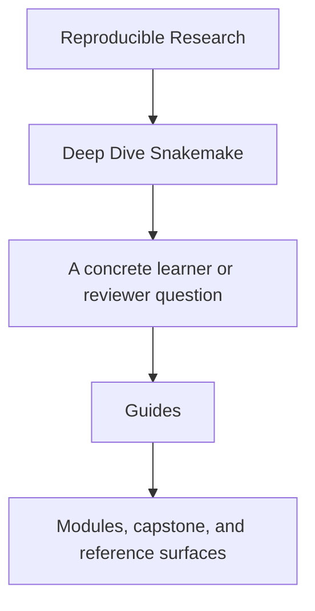
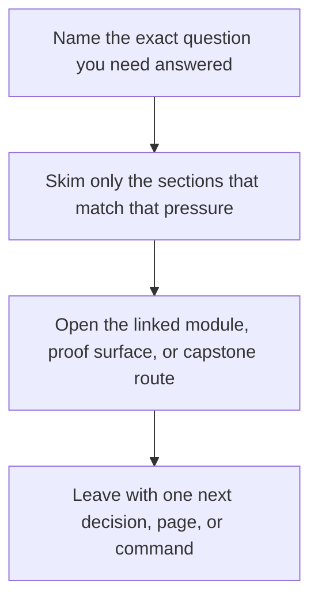

# Guides

<!-- page-maps:start -->
## Guide Fit

<!-- page-maps:end -->

Read the first diagram as a timing map: this guide is for a named pressure, not for wandering the whole course-book. Read the second diagram as the guide loop: arrive with a concrete question, use only the matching sections, then leave with one smaller and more honest next move.

Use this page when you know you need support material but do not yet know which guide is
the right one.

The rule is simple: open the smallest page that answers the next honest learner question.

## Read These First

- [Start Here](start-here.md) for the shortest honest entry route
- [Course Guide](course-guide.md) for the full module arc and page roles
- [Learning Contract](learning-contract.md) for the teaching bar and proof expectations
- [Module 00: Orientation and Study Practice](../module-00-orientation/index.md) for the course shape
- [Platform Setup](platform-setup.md) before you run local proof commands

## Use These For Study Planning

- [Pressure Routes](pressure-routes.md) when your route is shaped by repair, stewardship, or workflow pressure
- [Workflow Modularization](workflow-modularization.md) when the question is how far to split the workflow architecture
- [Module Promise Map](module-promise-map.md) when you want each module title translated into a learner contract
- [Module Checkpoints](module-checkpoints.md) when you want a module-end exit bar before moving on
- [Module Dependency Map](../reference/module-dependency-map.md) when you need the safe reading order explained
- [Practice Map](../reference/practice-map.md) when you want the module-to-proof loop in one place

## Use These For Commands And Proof

- [Command Guide](../capstone/command-guide.md) for command boundaries
- [Proof Ladder](proof-ladder.md) for choosing the smallest honest proof route
- [Proof Matrix](proof-matrix.md) for routing a claim to the right evidence surface
- [Boundary Map](../reference/boundary-map.md) when you need workflow versus policy separation
- [Glossary](../reference/glossary.md) when the vocabulary itself is the blocker

## Use These For Capstone Reading

- [Capstone Guide](../capstone/index.md) for the repository contract
- [Capstone Architecture Guide](../capstone/capstone-architecture-guide.md) for the repository structure
- [Capstone Map](../capstone/capstone-map.md) for module-to-repository routing
- [Capstone File Guide](../capstone/capstone-file-guide.md) for file responsibilities
- [Capstone Walkthrough](../capstone/capstone-walkthrough.md) for a bounded first reading route
- [Capstone Proof Guide](../capstone/capstone-proof-guide.md) for the shortest proof route
- [Publish Review Guide](../capstone/publish-review-guide.md) for publish-boundary review
- [Profile Audit Guide](../capstone/profile-audit-guide.md) for execution-policy review
- [Incident Review Guide](../capstone/incident-review-guide.md) for workflow triage under pressure
- [Capstone Review Worksheet](../capstone/capstone-review-worksheet.md) for structured repository assessment
- [Capstone Extension Guide](../capstone/capstone-extension-guide.md) for safe evolution

## Keep The Layout Stable

- `index.md` stays the course home
- `guides/` stays the learner route and proof shelf
- `capstone/` stays the capstone-specific reading, proof, and incident-review shelf
- `reference/` stays the durable workflow and review shelf
- `module-00-orientation/` plus Modules `01` to `10` stay the teaching arc

## Directory glossary

Use [Glossary](glossary.md) when you want the recurring language in this shelf kept stable while you move between study routes, proof routes, and support pages.
